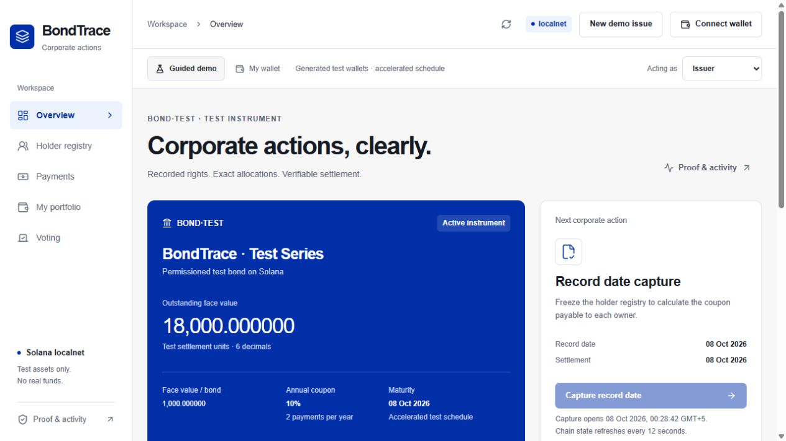

# BondTrace

A Solana console for tokenized-bond corporate actions, built for **Superteam Kazakhstan × KASE** at Crypto World's Fair 2026.

BondTrace follows one operational question through to settlement: **who is entitled, how much is owed, and what actually happened on chain?** Issuers manage the register and corporate actions; investors inspect fixed coupon rights, claim payments, vote and redeem principal.



## Three working corporate actions

- **Coupon:** a record-date cutoff preserves holder positions until the complete snapshot is captured. Subsequent transfers do not move historical coupon rights.
- **Maturity redemption:** the current holder receives principal and the corresponding bonds are burned in one Solana transaction.
- **Bondholder voting:** snapshot-weighted votes, one ballot per holder. Votes are informational and cannot alter financial terms.

This is a permissioned prototype for **test assets**. Its complete guided cycle is verified on a real local Solana validator. Devnet deployment remains blocked by free test-SOL funding. No KASE/fiat integration, real assets, customer traction or production security certification is claimed.

## Watch and inspect

- [Product demonstration](artifacts/demo/bondtrace-product-demo.mp4), with English narration and [captions](artifacts/demo/bondtrace-product-demo.en.srt).
- [Technical overview](docs/18-TECHNICAL-OVERVIEW.md): architecture, record dates, entitlements, settlement and trust assumptions.
- [Browser-driven lifecycle evidence](docs/evidence/browser-cycle-localnet.json) and [API lifecycle evidence](docs/evidence/full-smoke-localnet.json). These are **different** test issues; each retains its own signatures and timestamps.
- [Validation and remaining gates](docs/17-VALIDATION.md), [deployment checkpoint](docs/16-DEPLOYMENT.md), [submission materials](docs/14-SUBMISSION.md).

The video shows real UI actions and chain results using generated test signers. Idle waiting is edited; the recording is not a human-wallet signing test. Local Explorer links require a validator on the viewer's machine and are not publicly verifiable devnet receipts.

## Run on the prepared Windows workspace

Node 22.12+ and PowerShell 7 are required. Program tooling is installed in Ubuntu WSL: Anchor 1.1.2, Agave 3.1.10 and Rust 1.91.0. This project does not change global CLI network settings.

```powershell
cd C:\Users\dmitrii\Documents\solana
npm ci --ignore-scripts
npm run build:program
```

Open two terminals in that directory:

```powershell
# Terminal 1: validator; reuses a running matching program without resetting its ledger
npm run localnet
```

```powershell
# Terminal 2: API on port 3000 and web UI on port 5173
npm run dev
```

Visit **http://127.0.0.1:5173**. In **Guided demo**, create the test issue, then switch between Issuer and Investors 01–03. On an already settled issue, use **New demo issue** to create a new instrument; earlier chain transactions are preserved. Review each operation before clicking **Submit test transaction**.

The schedule uses actual chain time: local record date is about 90 seconds after setup, coupon payment five seconds later, and maturity five minutes after the record date. Capture the coupon before transferring or opening redemption. In the voting view, create a proposal before maturity and cast an investor vote. Claim coupon and principal separately as each holder.

For a built, single-origin app:

```powershell
npm run build
npm start
# http://127.0.0.1:3000
```

Defaults work without an `.env`. [.env.example](.env.example) documents the permitted networks. Generated test keys and local state stay under ignored `.local/`; never commit or share them. **My wallet** uses Wallet Standard and external signing; it does not send private keys to the API. Actual human-wallet signing still needs a separate test.

## Reproduce from source elsewhere

Install the pinned program tools from their official releases; [toolchain provenance](docs/research/kase-chain.md) records the versions and installation constraints. On Linux with those tools on `PATH`, build the program with:

```bash
NO_DNA=1 cargo build-sbf --manifest-path programs/bondtrace/Cargo.toml --sbf-out-dir target/deploy
solana-test-validator --ledger .local/bondtrace-validator --rpc-port 8899 --faucet-port 9900 --bind-address 127.0.0.1 --bpf-program B3aFCQ25iN3gjmvznAaY5RNnnw8J5ihFPsPoGgWXhmb8 target/deploy/bondtrace.so
```

Then run the same Node commands. The fixed public program ID can be loaded at genesis locally without the owner's program keypair. Independent devnet deployment requires your own program identity and rebuilding with its matching ID; this repository contains no deployment credentials. A fresh machine setup has not been independently reproduced.

## Verification

```powershell
npm test                 # exact amounts/IDL decoding and isolated mocked-RPC recovery
npm run test:ui          # formatting, safe proof URLs and UTF-8 proposal limits
npm run typecheck
npm run build
npm run test:program     # real SBF + SPL runtime tests in WSL
```

`npm run smoke` creates a **new local test issue**, waits for real record/maturity deadlines and writes a complete API/chain report. Do not run it during a demonstration you want to preserve. Its fixtures are test wallets, not users.

Current results: **9 client/recovery tests, 5 UI tests, 3 Rust unit tests and 5 SBF runtime tests passed**. Both an API cycle and a full browser-guided cycle settled 900 coupon units and 18,000 principal units, burned all 18 bonds and ended with zero vault balance. The model supports up to 16 registered holders and 8 coupons; the demo uses 3 holders and 1 coupon. Full prefunding is required, and excess funds have no withdrawal path.

## Structure and disclosure

`apps/web` is the React/Vite console; `server` is a loopback-only transaction relay and explicit test harness; `packages/client` contains exact arithmetic, state decoding and instruction builders; `programs/bondtrace` contains the Anchor program and generated IDL. Dependencies are pinned in npm/Cargo lockfiles. Transactions use v0 for the verified local validator/wallet compatibility path.

Development used AI assistance and installed ProofPilot/Solana/design guidance. No finished competitor project was imported. [Architecture](docs/09-ARCHITECTURE.md), [security limits](docs/11-SECURITY.md) and [review findings](docs/research/kase-integration-review.md) distinguish source inspection, mocked transport tests and real runtime evidence.

For continued agent work, read [AGENTS.md](AGENTS.md) and [current state](docs/00-STATE.md). Product decisions require ProofPilot; development, design and checks require suitable installed skills before substantial tasks. The earlier idea research is retained as history and does not certify this project's readiness. Repository publication, externally accessible links and final registration/submission remain owner-controlled gates.
