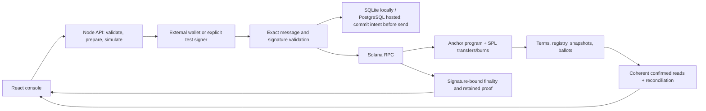

# BondTrace

**English** · [Русский](README.ru.md)

Corporate actions for tokenized bonds on **Solana**: identify eligible holders, fix their rights, calculate entitlements, settle payments and retain verifiable outcomes. Built for the **Superteam Kazakhstan × KASE** corporate-actions track.

## Open the working application

**[Live devnet application](https://bondtrace-devnet.onrender.com/)** · **[Completed issue](https://bondtrace-devnet.onrender.com/?view=payments&instrument=2KWpyE9mQWS6VTviCJFi1b4Zh55rti9xeDS6yk37sU7Y)** · **[On-chain instrument](https://explorer.solana.com/address/2KWpyE9mQWS6VTviCJFi1b4Zh55rti9xeDS6yk37sU7Y?cluster=devnet)**

No installation or site password is needed to inspect holders, payments, voting and receipts. The public app reads actual devnet accounts; each completed on-chain operation has a transaction signature. Connecting a wallet does not grant the issuer's or another holder's rights.

The service runs on **Render Free + Neon PostgreSQL**, with a hash-verified Solana program. Assets are test SPL tokens with no fiat value. The free services can sleep or hit RPC quotas; unavailable reads disable actions rather than invent a successful payment.


*Recorded public application after the verified lifecycle/restart on 9 October 2026: 900 test settlement units paid. The screenshot shows a connected wallet; human-wallet signing has its own verification scope below.*

## What is implemented

| KASE requirement | Working implementation | Evidence / source |
|---|---|---|
| Test tokenized instrument | Classic SPL bond mint, whole bond units, nominal, maturity and coupon dates; immutable annual rate/frequency through `FinancialTerms` | [Program](programs/bondtrace/src/lib.rs), [release](programs/bondtrace/release.json) |
| Holder registry | Issuer registers up to 16 wallets and issues to canonical bond token accounts | `register_holder`, `issue_units` |
| Record date | A due uncaptured record blocks transfers; capture fixes units permanently; later transfers/burns preserve the fixed coupon rights | `capture_coupon`, `Coupon.units` |
| Entitlements | Checked integer arithmetic, exact amounts and reconciliation | [Client math](packages/client/src/domain.ts), [technical guide](TECHNICAL.md) |
| Coupon payment | SPL transfer to the fixed beneficiary; holder claim or executor settlement; shared claim mask prevents duplicate payment | `claim_coupon`, `settle_coupon`; batches up to four recipients |
| Principal redemption | Maturity snapshot, principal transfer and bond burn in one atomic transaction; duplicate redemption rejected | `begin_redemption`, `redeem_principal` |
| Additional action | Snapshot-weighted bondholder voting; one ballot per holder | `create_vote`, `cast_vote`, Proposal/Ballot accounts |
| On-chain outcome | Program accounts, signatures, finality observations and retained execution proofs | [26-transaction hosted proof](docs/evidence/hosted-devnet-20261009.json), [API](docs/15-API-CONTRACT.md) |

For a regular-rate issue:

```text
perBondCouponMinor = faceValueMinor × rateBps / (10,000 × couponFrequency)
holderCouponMinor  = recordDateUnits × perBondCouponMinor
principalMinor     = maturityUnits × faceValueMinor

10 bonds × 1,000 × 10% ÷ 2 = 500 coupon
10 bonds × 1,000 = 10,000 principal
```

Bond decimals are **0**, settlement decimals **6**. JSON money uses integer strings and client calculations use BigInt. Rate creation rejects terms that cannot produce an exact base-unit coupon; it does not silently round a promise. Payment dates are explicit; no day-count convention is inferred.

## Verified results

| Check | Recorded outcome |
|---|---|
| Actual hosted devnet lifecycle | **26 distinct finalized transactions**: 22 corporate operations + 4 setup transactions |
| Cash and retirement | **900 coupons / 18,000 principal / 18 bonds burned**; remaining obligations, mint supply and vault balance all **0** |
| Record-date independence | Transfer changed current balances **10/5/3 → 10/4/4**; fixed coupon/voting weights stayed **10/5/3** |
| Required example and voting | First holder received **500 coupon + 10,000 principal**; ballot **13 yes / 5 no** |
| Negative cases | Unauthorized issuer, insufficient reserve, early capture, duplicate coupon and duplicate principal rejected |
| Hosted restart | Same **22 operation IDs and 26 signatures/proofs**, fixed rights, terms and financial totals recovered using GET only |
| Backup | Downloaded **204,800-byte** metadata database passed hash/integrity checks; no live restore claimed |
| Application/UI tests | **288 Node passed, 0 failed, 10 optional PostgreSQL skipped; 52 UI passed** |
| Separate program/database cohorts | **3 Rust unit + 16 SBF/SPL runtime cases, including 64 sequences**; **43 PostgreSQL tests, 0 skipped**, at their documented historical cutoffs |

Full signatures, source hashes, transaction proofs, failed attempts and recovery observations: [hosted evidence](docs/evidence/hosted-devnet-20261009.json), [deployment record](docs/33-HOSTED-DEPLOYMENT.md), [historical verification cohorts](docs/VERIFICATION-HISTORY.md). Counts from separate runs are not added together or presented as one fresh test.

## Reproduce real transactions locally

Clone with a GitHub account that has access to this private repository:

```powershell
git clone https://github.com/dimik98330/solana-worldsfair-2026.git
cd solana-worldsfair-2026
npm ci --ignore-scripts
npm run setup:judge
npm run demo:lifecycle
```

The verified full launcher uses **Windows x64, PowerShell 7, Node 22.14.0 and Ubuntu 24.04 x64 in WSL2**. Install those prerequisites first. `setup:judge` checks/downloads the pinned toolchain; **on a prepared machine, `npm run demo:lifecycle` is the one-command demonstration**. [Detailed setup, alternate distributions/ports and recovery](docs/LOCALNET-SETUP.md).

The command builds the program/app, starts an isolated Solana validator, issues/distributes bonds, records rights, pays coupons, votes, redeems/burns and prints actual signatures and a unique evidence path. It waits for real chain deadlines. Local test signers and assets are generated; no owner key is needed.

Default local endpoints: app/API **[127.0.0.1:3160](http://127.0.0.1:3160)** and RPC **8959**. Preserve IDs on interruption. Bootstrap resumes its saved ID; a new financial-demo invocation creates a new issue. **Do not rerun a financial driver to replace an unresolved signed payment.** Recover its existing operation/signature first.

WSL is needed for this Windows Solana build/runtime launcher, not for visiting the hosted app or running the hosted Node service. Native macOS/ARM and a cold install on another physical machine are not independently verified.

## Backend architecture



Solana is authoritative for financial effects. The off-chain journal supports discovery, exact-message relay and recovery. Signed bytes, signature and lifetime are committed before send. PostgreSQL requires an acknowledged COMMIT and fences replaced writers; an uncertain commit blocks new relay. GET recovery does not send. Explicit rebroadcast can use only the same retained bytes under genesis/release/expiry checks. Unknown outcomes never authorize another payment signature.

The whole-event coordinator pins its manifest/child IDs and bounds each resume. Principal remains holder-signed. Business settlement, individual transaction finality and parent aggregate provenance are distinct; no aggregate signature is invented.

## Run tests

```powershell
npm test
npm run test:ui
npm run build
npm run test:program
node scripts/write-program-release.mjs --check
```

`npm test` runs client/API/storage regressions; optional database cases skip without a configured isolated PostgreSQL fixture. Program tests execute the compiled SBF with SPL. [Linux CI](.github/workflows/backend-verify.yml) is manually triggered; remote CI execution is not claimed. `npm run verify:source` runs a separate isolated source/lifecycle reproduction and creates new test transactions.

## Hosting, wallets and scope

[Hosting guide EN/RU](docs/31-HOSTING.md) covers free Render native Node + Neon, exact origin, verified TLS, one API writer, disabled automatic demo signing and operator-authenticated backup/readiness. No private issuer/holder/deployment keys belong on the service. Free hosting has availability/size limits; preserve an off-host backup.

Wallet Standard requires the selected chain, transaction version and `solana:signTransaction`. Phantom discovery/connection/simulation were observed; the owner-reported approval then returned `Unexpected error` before API submission. **The investigation is complete, but successful Phantom signing is not verified**: [exact result](docs/evidence/hosted-wallet-check-20261009.json). The required Solana actions were independently executed with external cryptographic test signers. No sign-and-send bypass was added.

Implemented: the eight on-chain requirements, durable backend, exact reconciliation and EN/RU console. Simulated: test settlement currency, generated test identities and accelerated schedules. No bank, KASE API, legal securities register or custody/KYC integration is claimed. Limits: 16 holders, 8 coupons, 4 recipients per atomic batch, finite 32-proposal discovery window, whole bonds, full prefunding, issuer-opened redemption, no surplus withdrawal and reliance on RPC/history/settlement-token authority.

The owner records the final video and controls judge repository access, registration and final submission. Technical evidence does not establish organizer acceptance or eligibility.

## Documentation and source

| Entry | Purpose |
|---|---|
| [Judge guide](docs/JURY-GUIDE.md) | Inspection order, evidence and submission boundaries |
| [TECHNICAL.md](TECHNICAL.md) | Record-date logic, formulas, settlement, authority and recovery |
| [API contract](docs/15-API-CONTRACT.md) | Requests, exact strings and same-ID recovery |
| [Hosting](docs/31-HOSTING.md) / [deployment](docs/33-HOSTED-DEPLOYMENT.md) | Configuration and actual public execution/restart |
| [Verification history](docs/VERIFICATION-HISTORY.md) | Separate historical source/test cohorts |
| [Current readiness](docs/release/PROJECT-READINESS-20261009.md) | ProofPilot coach review of the project and README; not an official score |

Source: `programs/bondtrace` — Anchor/SBF; `packages/client` — instruction builders/BigInt; `server` — API/journal/recovery/proofs; `apps/web` — React console; `tests` — regressions; `scripts` — setup/verification/demo. No keys, database copies, runtime output, dependencies or raw recording intermediates belong in Git. Historical proofs/media are retained with their original scope.
