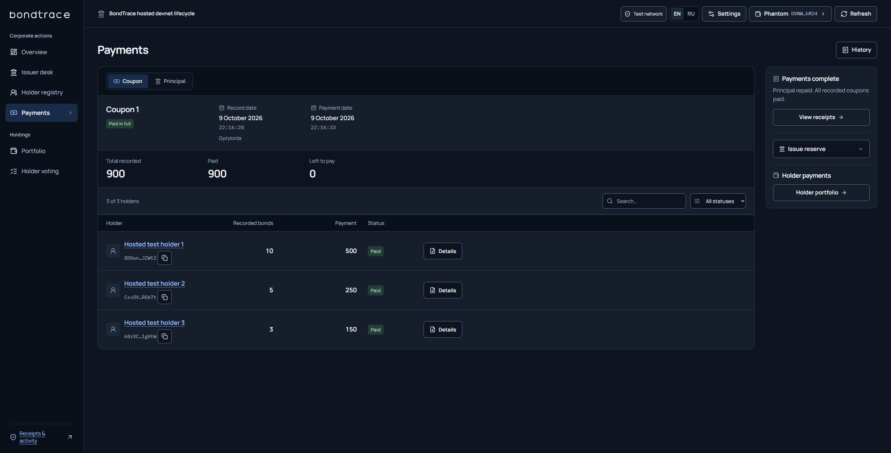
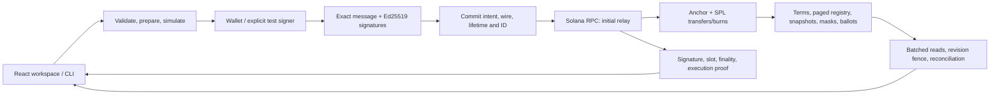
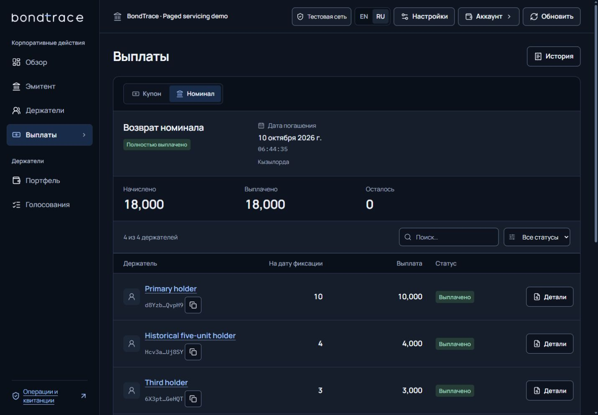

# BondTrace

**English** · [Русский](README.ru.md)

Corporate actions for tokenized bonds on **Solana**: identify holders → fix record-date rights → calculate entitlements → settle and retire bonds → retain verifiable outcomes. Built for **Superteam Kazakhstan × KASE**.

**[Open devnet application](https://bondtrace-devnet.onrender.com/)** · **[Completed issue](https://bondtrace-devnet.onrender.com/?view=payments&instrument=2KWpyE9mQWS6VTviCJFi1b4Zh55rti9xeDS6yk37sU7Y)** · **[Explorer](https://explorer.solana.com/address/2KWpyE9mQWS6VTviCJFi1b4Zh55rti9xeDS6yk37sU7Y?cluster=devnet)** · **[Technical overview](TECHNICAL.md)**

## What you can verify

The hosted application reads real devnet accounts and transaction receipts. It runs on Render Free with durable Neon PostgreSQL. Ordinary inspection needs no site password. Assets and settlement balances are **test SPL tokens without fiat value**. Free hosting may sleep; unavailable reads disable actions and preserve recovery identifiers.

| Version | Verification scope |
|---|---|
| Public devnet | Recorded v3 program, SHA `761b993d…077bdfd`: completed lifecycle, 26 finalized transactions, restart and backup. [Deployment record](docs/33-HOSTED-DEPLOYMENT.md). |
| Current v4 source | Additive paged accounts, permissionless maturity servicing, post-activation receivers and signed integration adapters. SBF SHA `ee2bb0f7…8f1ee12`; local verification is separate below. |
| Ordinary Phantom | Connection observed; sign-only transport and exact-message verification implemented and tested. A successful human Phantom transaction is **not yet confirmed**. |
| External institutions | Signed registry/settlement adapter and shadow reconciliation implemented. No KASE, bank, custodian or customer integration/endorsement is claimed. |

The v4 server requires its matching program image. Do not connect it to the older public program and bypass the hash check. Publishing source does not upgrade a Solana program. The wallet-only source fix is merged; hosted deployment must be checked separately.



*Actual public application captured 9 October 2026. Historical v3 evidence; a connected wallet is not proof of a successful wallet-signed transaction.*

## Functionality

| KASE requirement | Current implementation | Source |
|---|---|---|
| Test instrument | Classic SPL bond mint; whole units; immutable nominal, annual rate, frequency, maturity and explicit coupon dates | [BondV2 and pages](programs/bondtrace/src/v2_state.rs) |
| Holder registry | Canonical holder PDAs/ATAs; append-only pages of 8. Issuer can add zero-balance receivers after activation between record locks | [Program](programs/bondtrace/src/v2.rs) |
| Record date | Due records block transfers; sequential capture/finalization fixes the eligible registry prefix and quantities | `begin_coupon_v2`, `capture_action_page_v2`, `finalize_action_v2` |
| Entitlements | Checked integers; exact annual-rate validation; no floating point or silent subunit rounding | [Math](packages/client/src/domain.ts), [v4 contract](docs/34-PAGED-SERVICING.md) |
| Coupon payment | SPL transfer to the recorded beneficiary; holder claim or permissionless settlement; one shared paid bit | `claim_coupon_v2`, `settle_coupon_v2` |
| Redemption | Any fee payer can open due maturity capture; each holder atomically receives principal and burns their bonds | `begin_redemption_v2`, `redeem_principal_v2` |
| Additional action | Snapshot-weighted voting; one ballot per holder | `create_proposal_v2`, `cast_vote_v2` |
| On-chain outcome | Action/snapshot/ballot accounts, totals and masks; signatures, observed finality and retained proofs | [API](docs/15-API-CONTRACT.md), [devnet proof](docs/evidence/hosted-devnet-20261009.json) |

An absent issuer cannot veto v4 coupon capture or maturity opening. Preceding coupon records must be finalized; any fee payer can do that. Principal retirement needs the corresponding holder's signature. Executors cannot redirect beneficiaries.

```text
perBondCouponMinor = faceValueMinor × rateBps / (10,000 × frequency)
holderCouponMinor  = fixedRecordUnits × perBondCouponMinor
principalMinor     = maturityUnits × faceValueMinor

10 × 1,000 × 10% ÷ 2 = 500 coupon
10 × 1,000           = 10,000 principal
```

Bond decimals are **0**, settlement decimals **6**. TypeScript uses BigInt; JSON amounts are integer strings; Rust uses checked integers. A fractional base unit is rejected. Frequency is the annual divisor; dates do not invent a day-count convention.

## Quick local start: actual Solana transactions

```powershell
git clone https://github.com/dimik98330/solana-worldsfair-2026.git
cd solana-worldsfair-2026
npm ci --ignore-scripts
npm run setup:judge
npm run demo:paged:lifecycle
```

Prerequisites for this launcher: **Windows x64, PowerShell 7, Node 22.14.0, WSL2 with Ubuntu 24.04 x64**. `setup:judge` checks/downloads pinned Rust 1.91.0, Agave 3.1.10 and Anchor 1.1.2. First installation/build takes longer than a warm run. [Setup, native Linux, alternate distributions and recovery](docs/LOCALNET-SETUP.md).

On a prepared machine, **`npm run demo:paged:lifecycle` is the one command**: build → isolated validator/API → test mint/issue → distribute 10/5/3 → record rights and voting → add a receiver/transfer → coupons → principal/burn → late claim of an old coupon → results/signatures. Votes occur before maturity; their results remain afterward. It uses actual chain time and generated local test signers, without your key.

Paged launcher: **app/API `http://127.0.0.1:3200`, RPC `http://127.0.0.1:8999`**. Legacy `npm run demo:lifecycle`: 3160/8959. Different reviewed releases get separate native ledgers and ignored metadata namespaces. Unrelated occupied ports and mismatched images are rejected.

Larger scenario from the prepared checkout:

```powershell
pwsh -NoProfile -File scripts/lifecycle-demo.ps1 -Paged -Scale33 -LateCoupon -RpcPort 8999 -ApiPort 3200
```

It requests **33 initial holders, a 34th receiver and 9 coupons** with fixed retained batches. It prints a recovery ID, immutable launcher plan, origin and public evidence directory. This is a test scenario, not a production throughput benchmark.

On interruption preserve data, IDs, dates and signatures. Resume with **the same flags and `-OperationId <printed-id>`**. Existing signatures are reconciled first. Unknown outcomes stop dispatch; do not delete the journal or create replacement payments. A new ID means a new test issue.

WSL is used for Solana compilation/local validator on Windows. Browsing the public app or running hosted Node does not require WSL. Native macOS/ARM and a cold install on another physical machine are not independently verified.

## Manual application use

1. Inspect the public issue: holders, coupon/principal records, voting and receipts. Open a receipt's Explorer link to verify its signature.
2. Connect an installed wallet such as Phantom. Connection grants no issuer/other-holder authority. Devnet test SOL pays fees; mainnet is unsupported.
3. In a matching local v4 runtime, create an annual-rate/frequency or fixed-calendar issue. Supply dates, settlement mint and terms; review and sign. Registration, issuance and full funding precede activation.
4. Any account can pay due capture fees. Large snapshots advance page by page in the operations panel. Holders claim coupons or sign their own principal burn/payment; executors settle coupons only to fixed beneficiaries.

The automated demo uses generated signers. Ordinary Phantom signing remains an acceptance gap until a successful transaction is retained. Sign-only relays through the same journal; no silent wallet-broadcast fallback follows a failed prompt.

## Architecture and backend



- **Solana** is authoritative for financial effects. The API validates canonical accounts and reconciles exact supply/liabilities; contradictory observations fail closed.
- **Local SQLite**: transactional journal, DELETE/EXTRA, verified rollback, interprocess locking, filesystem guards and restart recovery. `STORAGE_BUSY` preserves uncertainty rather than inventing confirmation.
- **Hosted PostgreSQL**: acknowledged COMMIT, verified TLS and writer-generation fencing. Uncertain commit blocks new signing/relay; no fallback to an empty local database.
- **Recovery**: GET never sends. Confirmed-chain/pending-projection resumes with its original ID. Explicit rebroadcast accepts only retained bytes under release/genesis/expiry checks.
- **Adapters**: Ed25519 registry attestations, immutable exact-amount instructions, per-holder outboxes, signed acknowledgements, replay/conflict checks and audit export. Disabled by default; shadow acknowledgements never flip on-chain paid bits or authorize bank dispatch.

Contracts: [v4 servicing](docs/34-PAGED-SERVICING.md), [API](docs/15-API-CONTRACT.md), [integration](docs/integrations/PILOT-CONTRACT.md), [pilot runbook](docs/integrations/PILOT-RUNBOOK.md), [hosting](docs/31-HOSTING.md).

[Readiness and the four addressed critiques](docs/35-READINESS.md): the bounded technical report passed ProofPilot coach evidence checks; this is not an official score or complete human-wallet/partner acceptance.

## Verification

| Cohort | Observed outcome |
|---|---|
| Public v3 devnet, 9 October | **26 finalized transactions**; coupons **900**, principal **18,000**, **18 burned**; obligations/supply/vault **0** |
| Public record date | Current 10/5/3 → 10/4/4; fixed rights 10/5/3. First holder **500 + 10,000**; vote **13/5** |
| Public restart/backup | Same 22 business IDs/26 signatures recovered by GET; 204,800-byte portable database integrity checked |
| Current v4 program | SBF build, **3 unit + 20 SBF/SPL runtime tests** passed, including 64 sequences and 33→34 holders/9 coupons |
| Actual v4 RPC/localnet lifecycle | **33 → 34 holders, 9 coupons, 253 transactions**: 215 instrument/servicing + 38 auxiliary. **21,600 coupons / 48,000 principal / 48 burned**, supply/vault/obligations0; issuer absent from maturity opening; old 500 coupon claimed after burn |
| Actual prepared one-command launcher | A separate 3 → 4 holder / 2 coupon lifecycle passed; **37/37 signatures freshly finalized**, 1,800 coupons / 18,000 principal / 18 burned and zero supply/vault/obligations. [Independent built-origin/RPC check](docs/evidence/servicing-v4-one-command-check-20261010.json), [full report](docs/evidence/servicing-v4-one-command-20261010.json) |
| Current isolated GitHub verification | [Source `4e5dafa`, successful run](https://github.com/dimik98330/solana-worldsfair-2026/actions/runs/38010713994): **352 Node passed, 0 failed, 10 optional PostgreSQL skipped; 90 UI passed**. Independent SBF rebuild matched the exact v4 hash; 3 Rust unit / 20 runtime cases passed again |
| Current disposable PostgreSQL job | **40 passed, 0 failed, 3 TLS-fixture skips** using PostgreSQL16.15; the plain local fixture does not establish TLS. Same source/run, separate database job |
| Current storage | Real-process cold-open contention, namespace/symlink guards, bulk reads and same-ID projection recovery checked separately; complete-run scope is versioned |
| Adapter on actual local v4 chain | Entitlement **500,000,000** base units; signed shadow/replay survived API restart; financial graph unchanged; no bank dispatch |
| Historical database | **43 PostgreSQL tests** with TLS fixture passed at their cutoff; this is not a fresh current-source CI result |

[Verification history](docs/VERIFICATION-HISTORY.md) · [CI scope](docs/integrations/CI-VERIFICATION.md). A YAML workflow is not a green remote run. Counts from separate cohorts are not added together. Failed attempts retain their original scope.

Initial local complete runs failed under their documented versions; an older serial cut was stopped with 143 observed passes / 3 fixture timeouts. Those records remain retained. The later green isolated run validates the exact current source and does not retroactively turn failed local runs into passes.

[Compact v4 lifecycle results](docs/evidence/servicing-v4-localnet-summary-20261010.json) · [Full253 transaction proofs, 1.68 MB](docs/evidence/servicing-v4-localnet-20261010.json) · [Program/CI/shadow integration evidence](docs/evidence/servicing-v4-verification-20261010.json). The archived lifecycle records 247 finalized and 6 confirmed observations; a later passive query found 75 older statuses unavailable. [That history limitation](docs/evidence/servicing-v4-history-observation-20261010.json) is retained, and no claim of 253 freshly finalized transactions is made. A separate fresh API read verified revision 496 and zero financial obligations; permanent action accounts and retained transaction proofs remain distinct evidence.

The separate 37-transaction launcher run used `-SkipBuild` with the exact already verified SBF and a separately successful fresh web build. It retained the original 180/180/60-second chain-time schedule and required no retry, replacement ID or wallet prompt. This validates the prepared launcher, while cold-machine provisioning remains separately unverified.



*Prepared localnet v4, 10 October 2026: 18,000 principal paid, including 10,000 to the primary holder. Generated test signers; separate 37-signature fresh finality check. Warm launcher took 10:41 plus a 24-second web build on this host.*

```powershell
npm run typecheck
npm test
npm run test:ui
npm run build
npm run test:program
npm run test:integration-verifier
# Disposable PostgreSQL fixture only; wrapper rejects application databases:
npm run test:postgres
```

Coverage includes 500/10,000, remainder/overflow, immutable snapshots, post-record transfers, zero balances, authority/date/reserve failures, double coupon/principal/ballot, partial capture/restart, frozen vaults, page boundaries, old coupons after burn, conflicting IDs and database crash/commit uncertainty. Tests: [tests](tests), [UI helpers](apps/web/src).

## Limits and pilot path

V4 replaces whole-issue **16-holder / 8-coupon** arrays with 8-entry pages and u32 counts. Verified scale is bounded: full API graphs allow **4,096 account observations**; browser creation allows **16 coupons per transaction**, with larger declared schedules initialized/appended through explicit API or CLI calls; that workflow has no browser append control. History discovery has disclosed limits. [Exact bounds](docs/34-PAGED-SERVICING.md#explicit-limits--явные-границы).

Classic SPL bond accounts remain frozen outside controlled transfers for record-date enforcement. Ordinary SPL/DEX transfers are unsupported. Whole bonds, full prefunding, explicit calendar dates, upgrade authority, settlement-mint freeze authority and RPC/history availability remain assumptions. Voting does not automatically amend legal terms.

The adapter is a concrete pilot boundary. External acceptance needs a named registry/custodian, trusted keys/mappings, bank sandbox, signed reconciliation acceptance and legal/operational owners. No interviews, partnerships, demand, regulatory approval or official judging score are invented.

Private keys, .env, databases, signed intents and browser/auth state stay ignored. Keep independent metadata backups. Registration, final contest submission and demo-video upload remain owner actions.
