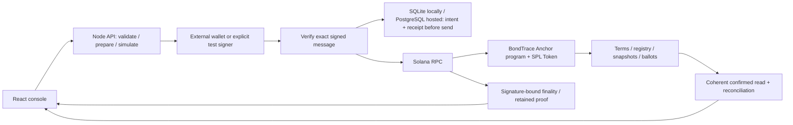

# BondTrace

**English** · [Русский](README.ru.md)

**A Solana workspace for tokenized-bond corporate actions: fix entitlement, settle coupons, redeem principal and verify the result.**

Built for the Superteam Kazakhstan × KASE corporate-actions challenge at Crypto World's Fair 2026. Issuers manage terms, holders and funding; investors inspect their fixed rights, claim payments, vote and redeem. The English/Russian console keeps amounts, signatures, outstanding obligations and receipts together.

**Live application: [bondtrace-devnet.onrender.com](https://bondtrace-devnet.onrender.com/).** Open it in a normal browser; no deployment login, WSL or local validator is needed. The React console and Node API use Solana **devnet** and **Neon PostgreSQL**, with the exact deployed SBF program verified. Connect a compatible Wallet Standard wallet such as Phantom on devnet; the connected wallet can sign only its own authorized actions. Viewing a holder does not grant that holder's signing rights.

**Test assets, actual blockchain execution.** Localnet verification and live deployment evidence have separate scopes in [the deployment record](docs/33-HOSTED-DEPLOYMENT.md). The owner confirmed Phantom connection to the public origin; successful human-wallet signing remains a separate check. Real securities, fiat settlement and KASE integration are simulated or absent. Free hosting can sleep or return a bounded RPC availability error.

### Check the deployed prototype in a browser

Open [the completed devnet issue](https://bondtrace-devnet.onrender.com/?view=payments&instrument=2KWpyE9mQWS6VTviCJFi1b4Zh55rti9xeDS6yk37sU7Y). Inspect coupon/principal records, holder positions, votes and **Receipts & activity**. Every action has a signature and Explorer link. No wallet is needed to inspect; connecting your own wallet does not grant rights held by the generated test accounts. A new issuer must create and fund its own issue before signing payments.

| Actual hosted check, 9 October 2026 | Observed result |
|---|---|
| Real devnet lifecycle through public HTTPS API | 26 distinct finalized transactions: 22 corporate operations + 4 setup transactions |
| Coupon / principal / token retirement | 900 / 18,000 test settlement units; 18 bonds burned; supply, vault and obligations all zero |
| Record date / example / additional action | Transfer changed balances10/5/3 →10/4/4; fixed coupon/vote weights stayed10/5/3. Primary holder received500 coupon and10,000 principal. Vote:13 yes /5 no |
| Render restart + Neon recovery | Same22 operation IDs/26 signatures/proofs/financial totals recovered with GET only; downloaded204,800-byte metadata database passed integrity verification |
| Current automated checks | 288 Node passed,0 failed,10 optional PostgreSQL skipped;52 UI passed. Separate hosted execution is actual Neon/devnet evidence |
| Human Phantom check | Connection and simulation passed; after owner approval the wallet returned `Unexpected error`. API received no signature; attempted account absent and test SOL balance unchanged |

[Full hosted evidence and signatures](docs/evidence/hosted-devnet-20261009.json) · [Exact Phantom result](docs/evidence/hosted-wallet-check-20261009.json) · [On-chain instrument](https://explorer.solana.com/address/2KWpyE9mQWS6VTviCJFi1b4Zh55rti9xeDS6yk37sU7Y?cluster=devnet). Historical failed runs and availability limits remain recorded; this is a test prototype, not an official judging or production certificate.

[Hosted verification report](docs/release/HOSTED-VERIFICATION-REPORT-20261009.md) · [Independent offline review](docs/release/HOSTED-EVIDENCE-REVIEW-20261009.md) · [ProofPilot coach protocol result](docs/evidence/proofpilot-hosted-quality-20261009.json): accepted on draft1 after eight checks, with one minor owner-report attribution note retained. This accepts the bounded report; the Phantom signing failure remains unresolved.

## Get the source

The repository is private; clone using an account with access:

```powershell
git clone https://github.com/dimik98330/solana-worldsfair-2026.git
cd solana-worldsfair-2026
npm ci --ignore-scripts
```

The primary path below runs a real local Solana validator and reads its current accounts. Each test issue and payout is created by actual transactions. Test assets have no fiat value; the financial state is not a hardcoded UI fixture.

## Run the actual localnet lifecycle

### First-time Windows setup

Install [Node **22.14.0**](https://nodejs.org/download/release/v22.14.0/), [PowerShell **7**](https://learn.microsoft.com/en-us/powershell/scripting/install/installing-powershell-on-windows), Git and [WSL2 with Ubuntu24.04](https://learn.microsoft.com/en-us/windows/wsl/install). The verified live path supports **Windows x64 + Ubuntu24.04 x64**. Linux can run the isolated CI checks below; the full runtime/lifecycle launcher is Windows/WSL-specific. Native macOS/ARM startup has not been verified.

If WSL/Ubuntu is missing, run Microsoft's installation command and complete its normal reboot/user setup:

```powershell
wsl --install -d Ubuntu-24.04
```

From the cloned repository, after the npm install above:

```powershell
npm run setup:judge
npm run demo:lifecycle
```

The setup helper uses explicit `-Distro`, inherited `BONDTRACE_WSL_DISTRO`, the workspace selection, then **Ubuntu-24.04**, in that order. Conflicting explicit/environment values or an existing different workspace selection are rejected. It checks/downloads Rust **1.91.0**, Agave **3.1.10** and Anchor **1.1.2** into the same WSL user's home used by the runtime. Only Linux OS packages use root/sudo; the first installation can request that WSL user's sudo password. Downloads are checksum-verified. Rust is pinned to this repository through `rust-toolchain.toml`; no existing global Rust default or Solana cluster configuration is changed. An already prepared matching toolchain is reused. Initial setup/build needs internet for downloads; warmed caches are reused.

For a different existing distribution, use a **separate clone** if this workspace already pins another ledger:

```powershell
pwsh -NoProfile -File scripts/judge-setup.ps1 -Distro YourPreparedDistribution
# Optional read-only prerequisite check:
pwsh -NoProfile -File scripts/judge-setup.ps1 -CheckOnly
```

Full source reproduction uses exactly **Node22.14.0**. The helper's prepared-distribution branch and full source lifecycle have been exercised on the development host; OS/WSL provisioning on another physical machine has not been independently tested.

### Prepared workspace: one command

```powershell
npm run demo:lifecycle
```

This builds the program and app, starts an isolated native Linux ledger and the built HTTP app, resumes test setup, creates a regular-rate issue, distributes bonds, records rights, pays two coupons, exercises voting and redeems/burns principal. It waits for actual chain deadlines and checks transaction proofs and restart persistence. Assets and signers are generated test fixtures.

Default endpoints: **app/API [127.0.0.1:3160](http://127.0.0.1:3160)**; Solana RPC `http://127.0.0.1:8959`. The command prints signatures, a bootstrap recovery ID and a unique evidence file. Bootstrap resumes its saved ID. The financial driver creates a new issue on each invocation; rerunning this command does not resume an interrupted financial driver. Recover interrupted payments through the saved operation/parent IDs and API before starting another issue. Transaction count can vary when extra test funding is needed. Preserve the IDs and evidence if interrupted; never replace an unresolved signed operation with a newly signed payment.

### Start the application without creating a new lifecycle

```powershell
npm ci --ignore-scripts
npm run build:program
npm run build
npm run runtime:start
```

The launcher verifies deployed program bytes, preserves the recorded ledger/genesis and refuses unrelated occupied ports. On a fresh runtime, use the application's explicit test setup; existing issues remain available. The issuer form creates fixed coupon schedules; annual-rate creation and the whole-event coordinator are API/lifecycle capabilities. Normal wallet mode prepares an unsigned reviewed message for external signing; generated demo signing is labelled separately.

Local public metadata and test keys are under ignored `.local/`; native ledgers stay in the selected WSL distribution. No owner keys or old fixtures are needed for source reproduction. [.env.example](.env.example) documents legacy development defaults; no `.env` is required by the isolated lifecycle command. `npm run dev` uses the legacy development ports, rather than the isolated endpoints above.

For alternate ports: `pwsh -NoProfile -File scripts/lifecycle-demo.ps1 -RpcPort 8949 -ApiPort 3150`. For a prepared runtime, `npm run runtime:watch` performs bounded readiness/storage supervision without signing financial actions. [TECHNICAL.md](TECHNICAL.md) explains restart and storage behavior.


*Current interface capture against the explicitly labelled read-only archive; this screenshot is not fresh chain proof.*

## What runs on Solana

The table maps the eight engineering requirements supplied by the owner to implementation and inspectable evidence. It is not an organizer score or certification.

| Requirement | Implemented behavior | Inspect |
|---|---|---|
| 1. SPL instrument and financial terms | Whole-unit bond mint; nominal, explicit maturity/coupon dates; fixed schedules or immutable program-validated annual rate/frequency | `initialize_issue`, `initialize_rate_issue`, `FinancialTerms`; [technical guide](TECHNICAL.md) |
| 2. Holder registry | Up to 16 registered wallets with canonical bond ATAs; issuer-controlled registration and issuance | `register_holder`, `issue_units`; [API](docs/15-API-CONTRACT.md) |
| 3. Immutable record date | Transfers stop at a due uncaptured cutoff; capture fixes historical units; later transfer/burn preserves coupon rights | `capture_coupon`, `Coupon.units`; [evidence packet](docs/release/BACKEND-EVIDENCE.md) |
| 4. Exact coupon and principal | Checked integer formulas and reserve reconciliation; fractional base units and conflicting rate amounts are rejected | Rust checked u128/u64, client BigInt; [current results](docs/30-BACKEND-STRENGTHENING-RESULTS.md) |
| 5. Coupon payment | Holder claim or permissionless executor delivery to the fixed canonical beneficiary; shared paid mask; atomic batches of up to four | `claim_coupon`, `settle_coupon`, durable coupon runs |
| 6. Redemption and retirement | Holder-signed principal transfer and bond burn occur atomically; repeat redemption fails; earlier unpaid coupons remain payable | `begin_redemption`, `redeem_principal` |
| 7. Additional corporate action | Immutable snapshot-weighted informational voting, one ballot per holder | `create_vote`, `cast_vote`, Proposal/Ballot accounts |
| 8. Verifiable outcome | Coherent financial state, signature-bound receipts, observed finality and retained execution proofs; provenance and gaps remain explicit | `/api/state`, `/api/program`, transaction proof endpoints |

For regular-rate issues:

```text
perBondCouponMinor = faceValueMinor × rateBps / (10,000 × couponFrequency)
holderCouponMinor  = recordDateUnits × perBondCouponMinor
principalMinor     = maturityUnits × faceValueMinor
```

For an unchanged ten-bond position at nominal 1,000, annual rate 10% and frequency 2: coupon **500**, principal **10,000**. Frequency is an annual divisor; payment dates remain explicit. No additional day-count or calendar convention is inferred. Bond decimals are 0; settlement decimals are 6. Money crosses JSON as integer strings, never floating-point values.

## Architecture and authority



Solana enforces issuer/holder authority, fixed rights, shared claim masks and atomic settlement/burn. SQLite locally, or explicitly selected PostgreSQL for hosting, stores discovery and recovery metadata. Signed bytes, signature, lifetime and operation ID are committed before network send. PostgreSQL requires an acknowledged COMMIT and fences replaced writers before signing/relay; an uncertain commit stops sending and preserves the same recovery identifiers. The relay accepts only the reviewed message with valid required signatures; wallet private keys stay outside normal signing mode.

GET recovery is passive. Explicit rebroadcast can send only the same retained signed bytes before expiry, under the required genesis/release checks. An unknown result never authorizes a replacement payment. The durable lifecycle coordinator pins a manifest and child IDs, bounds each resume and stops at unresolved work. Principal remains holder-signed.

Financial reads use a single confirmed bank context. Business settlement, observed transaction finality and retained proof provenance are distinct. A financially closed parent can still have unknown aggregate finality when external holder signatures are not linked to that parent; the separate signature index preserves the observed cohort evidence.

## Verification and evidence

Recorded backend snapshot: **SBF 541,456 bytes**, program `B3aFCQ25iN3gjmvznAaY5RNnnw8J5ihFPsPoGgWXhmb8`, SHA-256:

```text
761b993d403ae03a84e94475404299b0d4e798a6ea2d17ae44e003148077bdfd
```

The current release manifest is [programs/bondtrace/release.json](programs/bondtrace/release.json). Counts below describe their recorded runs; they do not claim every check was performed in the same run or that historical evidence matches later UI changes.

| Check | Recorded result | What it establishes |
|---|---|---|
| Clean-source application/client suite | **219 Node tests**, **52 UI tests**, application build and frozen SBF hash passed | Exact amounts, parsing, relay/recovery and UI regressions; mocked transports are not live-network evidence |
|9October backend/hosting follow-up | **241 Node tests**, **52 UI tests** and current app build passed, including the3asset-repair cases | Hosted auth/origin/storage, disabled-signer boundary, RPC redirects and real HTTP missing-asset behavior; separate cohorts |
| Published Git58 clean reproduction | **243 Node /52 UI**, all11commands passed_snapshot;39actual finalized transactions | Exact immutable Git58 source, native SQLite, new ledger and API/validator restart; [source-bound result](docs/evidence/jury-git58-reproduction-20261009.json) |
| Current application source e8f08fb | **266 Node passed /10optionalPG skipped,52UI**, all7commands passed_snapshot | Exact immutable Git archive: npm install/build, direct SBF build/hash and source-drift check; [result](docs/evidence/jury-gite8-source-20261009.json); no new financial transactions in this verify-only run |
| PostgreSQL preparation | **43 targeted tests,0skipped** against isolated PostgreSQL16.15; default suite266passed/10PGcases skipped,52UI and build passed | Real transactions/TLS/fencing/COMMIT-ack loss/backup; synthetic Solana in the barrier test is separate from real lifecycle proof |
| Real PostgreSQL-backed lifecycle | **39 actual Solana transactions**, all observed finalized; coupon2,500/principal25,000/burn25/remaining0 | Same IDs/totals after API+validator restart,105-document downloaded backup, no local fallback; [17source hashes and full proof](docs/evidence/postgres-preparation-20261009.json) |
| Isolated Linux hosted PostgreSQL | Node22.14.0/UID1000, verified TLS1.3, auth/origin/assets, backup/restart passed | [Actual process proof](docs/evidence/hosted-postgres-linux-20261009.json), financialReady:false because devnet program absent; no Render/Neon provisioning |
| Separate program test run | **3 Rust unit + 16 actual SBF/SPL runtime tests**, including **64 deterministic sequences** | Real compiled program execution in LiteSVM, financial invariants, rejection cases and rollback; separate from the clean live cycle |
| Main live built-origin lifecycle | **39 distinct localnet transactions**, all observed finalized with retained schema2 proofs | Coupons **2,500**, principal **25,000**, **25** bonds burned; remaining obligations, supply and vault **0**; actual API/validator restart |
| Separate clean-source lifecycle | **39 distinct localnet transactions**, same financial totals, fresh keys/state/genesis | Reproduction from an allowlisted source copy on the prepared host; compiler/npm caches may be reused |
| Runtime/storage probes | Bounded quota stop, readiness and recovery evidence | Owned runtime stops on storage limits; supervision does not sign payments |
| Current interface review | Recorded browser input/render evidence at **320 / 390 / 768 / 1440 / 2560** | Working console layout and interactions against the read-only archive; no new wallet/chain proof |
| GitHub Actions | Manually dispatchable workflow supplied | Definition only; no remote CI execution is claimed |

[Main lifecycle](docs/evidence/execution-strengthening-20261008172355127-29505989.json) · [clean reproduction manifest](docs/evidence/clean-source-reproduction.json) · [separate clean lifecycle](docs/evidence/execution-strength-clean-549f5703-645c-4870-8b70-ccc5c58f8a20.json) · [storage probes](docs/evidence/runtime-strengthening-probes.json) · [browser QA](docs/design-qa.md).

Each cohort retains its own issue, genesis, signatures and timestamps. At the final read-only review, the original RPC transaction history had been pruned: retained finalized observations are historical evidence, not a claim of fresh RPC confirmation today. Local Explorer links require the corresponding validator. These observations are not a third-party attestation.

```powershell
npm test
npm run test:ui
npm run build
npm run test:program
node scripts/write-program-release.mjs --check
npm run metadata:check
npm run verify:source
```

`verify:source` creates a new ignored source copy, builds it and runs another actual localnet lifecycle; it writes new test transactions. Likewise `demo:lifecycle`, `smoke` and `smoke:issuer` create new test issues. Run them deliberately. `metadata:check` checks SQLite integrity without chain mutation. For an isolated Ubuntu24.04 x64 CI runner/container with Node22.14.0 already installed:

```bash
BONDTRACE_CI=true bash scripts/setup-isolated-toolchain.sh
bash scripts/ci-verify.sh
```

PostgreSQL integration is separate from the default localnet setup: use a disposable loopback PostgreSQL16 database at127.0.0.1:32545 named bondtrace_tests, set BONDTRACE_TEST_PG_URL only in the test process, then run `npm run test:postgres`. The runner rejects unrelated endpoints and runs sequentially. [Optional local Compose fixture](deploy/postgres-test.compose.yaml) contains a synthetic public test password; its Docker image was not run here. TLS handshake cases additionally need BONDTRACE_TEST_PG_CA and a matching local TLS server. Never reuse the hosted DATABASE_URL for destructive schema/fault tests. The published43-test cohort used a real isolated server and local test CA, with no skipped TLS cases.

This runs application/client/UI/SBF and Rust runtime checks. It does not run the live Windows lifecycle or prove a devnet deployment. The GitHub workflow is manual, not automatically triggered by a push.

## Try actions yourself and connect a wallet

After live startup, open the app on3160 and inspect network/instrument details. Explicit test mode lets you select issuer/investors, create a new issue, distribute bonds, fund reserve, capture the record date, settle coupons, vote and redeem principal. These actions send actual localnet transactions; the backend rereads Solana accounts and reconciles the outcomes. Use `npm run demo:lifecycle` for the scripted complete scenario.

**Your wallet:** choose **My wallet**, then an installed Wallet Standard wallet. It must advertise `solana:localnet` and `solana:signTransaction`; incompatible wallets are not relabelled as another network. Signing stays in the wallet; the API verifies the exact reviewed message and relays it to the configured RPC. See [external signing and live-network verification](docs/release/WALLET-AND-LIVE-VERIFICATION.md).

For extensions that read the standard local endpoint, run `npm run wallet:localnet` in a second terminal after the runtime starts. This optional loopback alias exposes reads/simulation on8899 against the recorded8959 ledger and rejects transaction submission; the app retains its reviewed relay. It refuses an occupied port and does not reconfigure the wallet.

**Historical localnet Phantom check,9October2026:** discovery, owner-approved connection and application-side simulation passed. After owner approval, the extension returned `Unexpected error`; the API remained `not_submitted`, with no signature or fee charged. See [the exact check](docs/evidence/external-wallet-check-20261009.json). The later public **devnet** origin is deployed and the owner confirmed Phantom connection there; that does not establish a successful Phantom transaction or repair the historical localnet error. Generated external test identities use real cryptographic signatures; their execution evidence has a separate scope.

## Hosted application and deployment

[ProofPilot coach preparation review](docs/release/PROOFPILOT-PREPARATION-REVIEW-20261009.md) completed a separate-context review and eight quality checks; [hash-bound result](docs/evidence/proofpilot-preparation-quality-20261009.json). Its conclusion is readiness for the owner-assisted deployment stage, with cloud/wallet/submission gates explicit.

[Hosting guide — English/Russian](docs/31-HOSTING.md) describes the **free Render native Node + external Neon PostgreSQL + Solana devnet** deployment. [render.yaml](render.yaml) pins Node22.14.0, one instance, disabled automatic deploys/generated signing, verified database TLS and the exact public origin. The app and ordinary API are public; only operator backup/readiness uses a separate login. Localnet defaults remain free SQLite with a real validator; hosting needs no WSL or local validator.

PostgreSQL persists public recovery metadata independently from Render's ephemeral filesystem; unknown COMMIT outcomes block new sends. Operator-authenticated `/api/metadata/backup` downloads a verified portable SQLite snapshot+manifest; [unpack helper](scripts/unpack-metadata-backup.mjs) checks its hash/integrity without restoring the service. Free providers can sleep and have quotas. Actual Render/Neon deployment and the canonical devnet program are verified; [current lifecycle/restart status](docs/33-HOSTED-DEPLOYMENT.md) is recorded separately from earlier localnet tests. The former paid [Docker/SQLite alternative](deploy/render-sqlite.yaml) retains its historical Linux proof and requires separate budget approval.

## Optional: inspect the saved interface snapshot

```powershell
npm run build:web
npm run preview:ui
```

[127.0.0.1:4180](http://127.0.0.1:4180/?view=payments) is explicitly labelled **Saved snapshot / Архив**. Signing and writes are disabled. This auxiliary mode does not replace live3160 or prove current chain state.

## Implemented, simulated and remaining work

**Implemented:** custom SBF program, SPL token transfers/burn, immutable terms and snapshots, exact coupon/principal settlement, informational ballots, verified-message relay, durable receipts/coordinator, reconciliation and bounded local runtime supervision.

**Simulated fixtures:** settlement currency has no fiat value; signers represent generated test identities; short schedules make the lifecycle practical to demonstrate. No bank, KASE API, custody/KYC service or legal securities register is integrated.

**Limits:** 16 holders, 8 coupons, four recipients per atomic batch and a finite 32-proposal discovery window; whole bond units; full prefunding; no surplus withdrawal; issuer availability to open redemption; independent settlement-token freeze authority and RPC/history trust. Successful human-wallet execution, production security/regulatory processes and cold setup on another physical machine require separate validation. Repository access and final contest submission remain separate owner actions.

**Submission video:** the owner will record the final video. Existing [historical video](artifacts/demo/bondtrace-product-demo.mp4) and [captions](artifacts/demo/bondtrace-product-demo.en.srt) are retained for provenance; they show an earlier UI/issue/release and must not be presented as this final version.

## Source map

```text
apps/web/             React/Vite console, Wallet Standard, English/Russian UI
programs/bondtrace/    Anchor program, IDL and expected release manifest
packages/client/      Exact arithmetic, instructions and state decoding
server/               HTTP API, coherent reads, SQLite/PostgreSQL, recovery and proof capture
scripts/              Toolchain, runtime, lifecycle, source reproduction and CI
tests/                Client/server regressions and real SBF/SPL runtime tests
docs/evidence/        Public test receipts, manifests and reviewed UI captures
```

Read the [judge delivery checks](docs/release/JURY-DELIVERY-CHECKS.md) for this packaging pass, [TECHNICAL.md](TECHNICAL.md) for engineering behavior, [API contract](docs/15-API-CONTRACT.md) for request/recovery semantics and [backend evidence packet](docs/release/BACKEND-EVIDENCE.md) for the review map. [AUDIT.md](AUDIT.md) retains the original findings; [current strengthening results](docs/30-BACKEND-STRENGTHENING-RESULTS.md) document later repairs. Maintainer continuation starts with [AGENTS.md](AGENTS.md) and [STATE](docs/00-STATE.md).

Development used AI assistance and pinned open-source dependencies. No finished competitor project was imported. No traction, partnership, official score or production certification is asserted.
