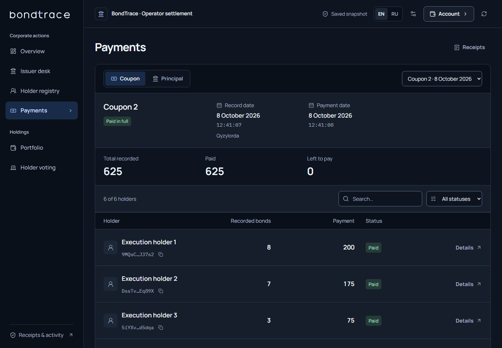
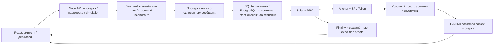

# BondTrace

[English](README.md) · **Русский**

**Приложение на Solana для обслуживания токенизированных облигаций: определить права держателей, выплатить купоны, погасить номинал и проверить результат.**

Проект подготовлен для Superteam Kazakhstan × KASE на Crypto World's Fair 2026. Эмитент управляет условиями, реестром и резервом; инвесторы проверяют права, получают выплаты, голосуют и погашают облигации. Интерфейс поддерживает русский и английский языки, точные суммы, подписи транзакций и сверку обязательств.

**Проверенная область — рабочий прототип на настоящем Solana localnet с тестовыми SPL-активами и сгенерированными тестовыми подписантами.** Devnet, исполнение через настоящий пользовательский кошелёк, публичный хостинг, реальные ценные бумаги, банковские расчёты и интеграция с KASE этим пакетом не подтверждены.

## Получить исходники

Репозиторий приватный: клонировать с GitHub-аккаунтом, которому выдан доступ:

```powershell
git clone https://github.com/dimik98330/solana-worldsfair-2026.git
cd solana-worldsfair-2026
npm ci --ignore-scripts
```

Основной путь ниже запускает настоящий локальный Solana-валидатор и читает его текущее состояние. Выпуск и выплаты создаются реальными транзакциями. Активы не имеют фиатной стоимости; финансовые значения не подставляются в интерфейс из захардкоженного макета.

## Поднять полноценный localnet и выполнить транзакции

### Первый запуск на Windows

Поддержанный путь: **Windows x64 + Ubuntu 24.04 x64 в WSL2**. Установить:

- [Node 22.14.0](https://nodejs.org/download/release/v22.14.0/);
- Git и [PowerShell 7](https://learn.microsoft.com/en-us/powershell/scripting/install/installing-powershell-on-windows);
- [WSL2 с Ubuntu 24.04](https://learn.microsoft.com/en-us/windows/wsl/install).

Если WSL/Ubuntu ещё нет, выполнить официальную команду Microsoft и завершить обычную настройку пользователя/перезагрузку:

```powershell
wsl --install -d Ubuntu-24.04
```

После клонирования и `npm ci --ignore-scripts`, из корня проекта:

```powershell
npm run setup:judge
npm run demo:lifecycle
```

`setup:judge` выбирает WSL-систему в порядке: явный `-Distro`, переменная `BONDTRACE_WSL_DISTRO`, сохранённый выбор проекта, Ubuntu-24.04. Конфликт явного значения с переменной окружения или с уже выбранной системой проекта отклоняется. Проверяет/устанавливает Rust 1.91.0, Agave 3.1.10 и Anchor 1.1.2 в домашнюю директорию того же Linux-пользователя, от которого запускается приложение. Только установка системных Linux-пакетов использует root/sudo; при первом запуске может потребоваться пароль пользователя Ubuntu. Загрузки проверяются по SHA-256. Rust закреплён для репозитория через `rust-toolchain.toml`; существующие глобальные настройки Rust и кластер Solana не переключаются. Подходящие установленные инструменты переиспользуются.

Первая установка и сборка требуют интернета для зависимостей и инструментов; повторные запуски используют кеши. Наличие npm-зависимостей само по себе не устанавливает Solana-компилятор.

Для другой подготовленной WSL-системы:

```powershell
pwsh -NoProfile -File scripts/judge-setup.ps1 -Distro YourPreparedDistribution
# Только проверить предпосылки:
pwsh -NoProfile -File scripts/judge-setup.ps1 -CheckOnly
```

Если рабочая папка уже привязана к другой WSL-системе и ledger, использовать отдельный клон: помощник запрещает незаметно менять эту привязку. Полное воспроизведение требует именно Node 22.14.0. Проверены подготовленная ветка setup и сквозное воспроизведение на рабочем компьютере; установка ОС/WSL на другом физическом компьютере отдельно не проверялась.

### На подготовленном окружении — одна команда

```powershell
npm run demo:lifecycle
```

Команда собирает программу и приложение, запускает отдельный native Linux ledger и HTTP-приложение, восстанавливает тестовую настройку, выпускает инструмент с проверяемыми ставкой/частотой, распределяет облигации, фиксирует права, выплачивает два купона, выполняет голосование, погашает номинал и сжигает облигации. Даты проверяются по настоящему времени блокчейна. Прогон проверяет доказательства транзакций и сохранность состояния после рестартов.

Адреса: **приложение/API [127.0.0.1:3160](http://127.0.0.1:3160)**, Solana RPC `http://127.0.0.1:8959`. В консоли выводятся подписи, bootstrap recovery ID и путь нового JSON с доказательствами. Bootstrap использует сохранённый ID. Финансовый driver при каждом вызове создаёт новый выпуск; повтор этой команды не возобновляет прерванный финансовый driver. Прерванные выплаты сначала восстанавливаются через сохранённые operation/parent IDs и API. Количество транзакций может отличаться при дополнительном тестовом финансировании. Не заменять неизвестный результат новой подписью платежа.

### Запустить приложение без нового финансового сценария

```powershell
npm ci --ignore-scripts
npm run build:program
npm run build
npm run runtime:start
```

Launcher сверяет байткод программы, сохраняет старый ledger/genesis и отказывается занимать чужие порты. На новом runtime тестовый выпуск создаётся явно через приложение; существующие выпуски сохраняются. Форма эмитента поддерживает фиксированные купонные расписания; годовая ставка/частота и координатор жизненного цикла доступны через API и сквозной скрипт.

Обычный режим кошелька готовит неподписанную транзакцию для внешнего подписания. Режим сгенерированных тестовых подписантов обозначен отдельно. Метаданные и тестовые ключи лежат в игнорируемой `.local/`, native ledger — внутри выбранной WSL-системы. Ключи владельца и старые fixtures не нужны для воспроизведения исходников. `.env` для изолированного сквозного запуска не требуется; [.env.example](.env.example) описывает прежние development defaults. `npm run dev` использует прежние порты разработки.

Другие порты: `pwsh -NoProfile -File scripts/lifecycle-demo.ps1 -RpcPort 8949 -ApiPort 3150`. `npm run runtime:watch` отдельно включает ограниченный контроль состояния и хранения; supervisor не подписывает финансовые действия.



*Актуальный интерфейс с явно обозначенным архивным снимком. Скриншот не является свежим подтверждением блокчейна.*

## Что реализовано по требованиям KASE

| Требование | Реализация | Где проверить |
|---|---|---|
| Тестовый инструмент | SPL-облигации; номинал, погашение, купонные даты; фиксированное расписание или ставка/частота в неизменяемом FinancialTerms PDA | `initialize_issue`, `initialize_rate_issue`, [TECHNICAL.md](TECHNICAL.md) |
| Реестр держателей | До16 зарегистрированных кошельков и canonical ATA; регистрацию/выпуск контролирует эмитент | `register_holder`, `issue_units`, [API](docs/15-API-CONTRACT.md) |
| Record date | На наступившем cutoff переводы приостанавливаются до полного снимка; дальнейшие переводы/сжигание сохраняют исторические купонные права | `capture_coupon`, `Coupon.units` |
| Расчёт прав | Checked integer/BigInt; точные формулы и резерв; дробная базовая единица и несовпадение ставки с купоном отклоняются | [Текущие результаты](docs/30-BACKEND-STRENGTHENING-RESULTS.md) |
| Купон | Получение держателем либо доставка исполнителем строго зафиксированному получателю; одна paid mask; атомарные батчи≤4 | `claim_coupon`, `settle_coupon`, durable coupon runs |
| Погашение | Выплата номинала и SPL burn в одной транзакции с подписью держателя; повтор запрещён; старые невыплаченные купоны доступны после burn | `begin_redemption`, `redeem_principal` |
| Дополнительное действие | Голосование с неизменяемым снимком весов и одним бюллетенем на держателя | `create_vote`, `cast_vote`, Proposal/Ballot |
| Проверяемый результат | Ончейн-аккаунты/события, подписи, отдельно наблюдённая финализация и сохранённые execution proofs | `/api/state`, `/api/program`, transaction proof endpoints |

Таблица описывает инженерную реализацию, а не официальный конкурсный балл.

### Формулы

```text
купонНаОблигацию = номинал × ставкаВБазисныхПунктах / (10 000 × частота)
купонДержателя   = количествоНаRecordDate × купонНаОблигацию
номиналКВыплате  = количествоНаПогашение × номинал
```

Для неизменённой позиции 10 облигаций с номиналом 1 000, ставкой 10% и частотой 2: **купон 500**, **номинал 10 000**. Это проверено отдельным SBF-тестом. Частота — делитель годового купона; даты задаются явно, дополнительные day-count/calendar conventions не подразумеваются. Облигации имеют 0 десятичных разрядов, расчётный токен —6. Деньги передаются через JSON как целочисленные строки, без float.

## Архитектура и backend



Solana контролирует права эмитента/держателей, неизменяемые права на выплаты, claim masks и атомарность выплаты/сжигания. SQLite локально или явно выбранный PostgreSQL на хостинге хранит восстановление операций; владение и расчёты остаются ончейн. Подписанные байты, подпись, срок действия и operation ID сохраняются транзакционно **до отправки**. PostgreSQL требует подтверждённый COMMIT и проверяет активного писателя перед подписью/relay; неопределённый COMMIT останавливает отправку, сохраняя прежний ID. Relay принимает только проверенное сообщение с валидными обязательными подписями. Приватные ключи обычного пользовательского кошелька в API не передаются.

GET-восстановление не отправляет транзакции. Явный rebroadcast допускает только те же сохранённые подписанные байты до истечения срока и с проверкой genesis/release. Неопределённый исход не разрешает новый платёж. Координатор фиксирует manifest и child IDs, ограничивает количество отправок при resume и останавливается при pending/unknown; погашение номинала остаётся подписываемым держателем.

Финансовые числа читаются одним confirmed bank context и проходят точную сверку. Факт расчётного закрытия, observed finality и происхождение сохранённого proof — отдельные состояния. Если внешние подписи держателей не привязаны к parent manifest, его aggregate finality может быть unknown даже после закрытия обязательств; отдельный индекс доказательств содержит подписи проверенного прогона.

## Какие проверки проведены

Зафиксированный backend release: **541 456 байт**, программа `B3aFCQ25iN3gjmvznAaY5RNnnw8J5ihFPsPoGgWXhmb8`.

```text
SHA-256: 761b993d403ae03a84e94475404299b0d4e798a6ea2d17ae44e003148077bdfd
```

| Проверка | Зафиксированный результат | Что подтверждает |
|---|---|---|
| Чистая копия исходников |219 Node,52 UI, сборка приложения/SBF и совпадение frozen hash | Точные суммы, парсинг, recovery/relay, UI-регрессии; mocked RPC не выдаётся за live chain |
| Backend/hosting9октября |241Node,52UI и текущая сборка прошли, включая3asset-регрессии | Вход/origin/диск, блокировка demo-подписантов, RPC redirects и настоящий HTTP-отказ для отсутствующих assets; отдельные наборы доказательств |
| Чистое воспроизведение опубликованного Git58 |243Node/52UI, все11команд passed_snapshot;39настоящих finalized-транзакций | Неизменяемый Git58, SQLite, новый ledger и API/validator restart; [результат с привязкой к source](docs/evidence/jury-git58-reproduction-20261009.json) |
| Текущий код приложения e8f08fb |266Nodepassed/10optionalPGskipped,52UI, все7команд passed_snapshot | Неизменяемый Git-архив: npm install/build, сборка/хеш SBF и отсутствие source-drift; [результат](docs/evidence/jury-gite8-source-20261009.json); verify-only не отправляет новые финансовые транзакции |
| PostgreSQL-подготовка |43профильных теста,0пропусков на PostgreSQL16.15; обычный набор266passed/10PGкейсов skipped,52UI и build passed | Настоящие транзакции БД/TLS/fencing/потеря COMMIT-ack/backup; SolanaRPC в barrier-тесте синтетический и отделён от live lifecycle |
| Настоящий lifecycle с PostgreSQL |39реальных Solana-транзакций, все observed finalized; купоны2 500/номинал25 000/burn25/остаток0 | Прежние IDs/итоги после API+validator restart, скачан backup105документов, local fallback отсутствует; [17source hashes и полный proof](docs/evidence/postgres-preparation-20261009.json) |
| Отдельный Linux hosted PostgreSQL |Node22.14.0/UID1000, verifiedTLS1.3, auth/origin/assets/backup/restart passed | [Проверка настоящего процесса](docs/evidence/hosted-postgres-linux-20261009.json), financialReady:false из-за отсутствия devnet-программы; без Render/Neon provisioning |
| Отдельный program-run |3 Rust unit +16 SBF/SPL runtime, включая64 последовательности | Реальный скомпилированный SBF в LiteSVM, финансовые инварианты, отказы и rollback |
| Основной live API-прогон |39 отдельных localnet-транзакций, observed finalized и schema2proofs |2 500 купонов,25 000 номинала,25 сожжённых облигаций; obligations/supply/vault0; API/validator restart |
| Отдельный clean-source live-прогон |39 транзакций, те же финансовые итоги, новые keys/state/genesis | Воспроизведение на подготовленном компьютере, с допустимым переиспользованием compiler/npm caches |
| Runtime/storage | Quota stop, readiness и recovery probes | Остановка только собственного runtime при лимите хранения; без финансовых подписей |
| Интерфейс | Browser input/render evidence320/390/768/1440/2560 | Вёрстка и действия на read-only архиве; без новой wallet/chain-аттестации |
| GitHub Actions | Подготовлен manual workflow | Конфигурация; исполнение remote CI отдельно не заявляется |

[Основной прогон](docs/evidence/execution-strengthening-20261008172355127-29505989.json) · [clean manifest](docs/evidence/clean-source-reproduction.json) · [отдельный clean-прогон](docs/evidence/execution-strength-clean-549f5703-645c-4870-8b70-ccc5c58f8a20.json) · [storage probes](docs/evidence/runtime-strengthening-probes.json) · [browser QA](docs/design-qa.md).

Каждый набор доказательств сохраняет свои issue/genesis/signatures/timestamps. К итоговому read-only review RPC уже очистил историю исходного прогона: сохранённые finalized observations являются историческими доказательствами, а не свежим публичным подтверждением сегодня. Local Explorer требует соответствующего validator. Это не независимая внешняя аттестация.

### Повторить проверки

```powershell
npm test
npm run test:ui
npm run build
npm run test:program
node scripts/write-program-release.mjs --check
npm run metadata:check
npm run verify:source
```

`verify:source` создаёт новую игнорируемую копию исходников, собирает её и выполняет другой реальный localnet lifecycle с новыми тестовыми транзакциями. В его Windows-прогон Rust-suite не входит: program-тесты выполняются отдельно. `demo:lifecycle`, `smoke` и `smoke:issuer` также создают тестовые выпуски; запускать осознанно. `metadata:check` проверяет выбранное хранилище без изменения блокчейна.

PostgreSQL-тесты идут отдельно: нужна одноразовая локальная PostgreSQL16 на127.0.0.1:32545 с БД bondtrace_tests. Задайте BONDTRACE_TEST_PG_URL только в окружении тестового процесса и выполните `npm run test:postgres`; runner отвергает другие адреса и запускает кейсы последовательно. [Необязательный Compose fixture](deploy/postgres-test.compose.yaml) содержит публичный синтетический пароль, его Docker image здесь не запускался. TLS-кейсам дополнительно нужны BONDTRACE_TEST_PG_CA и локальный TLS-сервер с подходящим сертификатом. **Не использовать hosted DATABASE_URL** для schema/fault-тестов. Опубликованный прогон43тестов использовал настоящий отдельный сервер и тестовый CA без пропусков.

В изолированном Ubuntu 24.04 x64 CI runner/container с заранее установленным Node 22.14.0:

```bash
BONDTRACE_CI=true bash scripts/setup-isolated-toolchain.sh
bash scripts/ci-verify.sh
```

Linux CI выполняет application/client/UI/SBF и Rust runtime checks, но не полный Windows lifecycle и не devnet deployment. GitHub workflow запускается вручную, а не автоматически после push. Native macOS/ARM-запуск не проверен.

## Проверить действия самому и подключить кошелёк

После live-запуска открыть приложение3160, проверить сведения о сети и выпуск. В явном тестовом режиме можно выбрать эмитента/инвесторов, создать новый выпуск, распределить облигации, пополнить резерв, зафиксировать record date, выплатить купон, проголосовать и погасить номинал. Эти действия отправляют настоящие транзакции в localnet; backend заново читает счета Solana и сверяет итоги. Для готового полностью пройденного сценария использовать `npm run demo:lifecycle`.

**Свой кошелёк:** выбрать «Мой кошелёк / My wallet», затем установленный Wallet Standard-кошелёк. Он должен объявлять поддержку именно `solana:localnet` и `solana:signTransaction`; несовместимый кошелёк не получает подменённую метку сети. Подпись выполняется в кошельке, API проверяет точное сообщение и отправляет его в настроенный RPC. См. [инструкцию внешнего подписания и проверки живой сети](docs/release/WALLET-AND-LIVE-VERIFICATION.md).

Если расширение читает стандартный локальный RPC, после запуска runtime выполнить `npm run wallet:localnet` во втором терминале. Необязательный loopback-прокси предоставляет чтение/симуляцию на8899 из сохранённого ledger8959 и запрещает отправку транзакций; проверенный relay остаётся в приложении. Занятый порт не перехватывается, настройки кошелька не меняются.

**Проверка Phantom9октября2026:** обнаружение, подтверждённое владельцем подключение и симуляция приложения прошли. После подтверждения в расширении получен `Unexpected error`; API остался `not_submitted`, без подписи и списания комиссии. Успешная транзакция Phantom **не подтверждена**, причина сбоя пока не установлена. См. [точный результат](docs/evidence/external-wallet-check-20261009.json). Наличие прокси не доказывает совместимость кошелька. Devnet требует отдельного развёртывания, финансирования и подписи. Сквозной localnet-прогон использует настоящие криптографические тестовые подписанты и не требует расширения.

## Подготовка хостинга

[Отчёт ProofPilot coach](docs/release/PROOFPILOT-PREPARATION-REVIEW-20261009.md) прошёл независимое ревью и восемь проверок качества; [запись с хешами](docs/evidence/proofpilot-preparation-quality-20261009.json). Вывод — готовность к совместному deployment с владельцем; cloud/кошелёк/финальная подача остаются отдельными проверками.

[Руководство EN/RU](docs/31-HOSTING.md) описывает подготовленный путь **бесплатный Render native Node + внешний PostgreSQL Neon + Solana devnet**. [render.yaml](render.yaml) фиксирует Node22.14.0, одну инстанцию, выключенный автодеплой/demo, проверяемый TLS и точные доступ/origin. Локально сохраняется бесплатный SQLite с настоящим валидатором; на хостинге WSL/локальный валидатор не нужен.

PostgreSQL хранит журнал отдельно от временной файловой системы Render; неопределённый COMMIT блокирует новые отправки. После входа `/api/metadata/backup` скачивает проверенную SQLite-копию+manifest; [команда распаковки](scripts/unpack-metadata-backup.mjs) сверяет hash/integrity без восстановления сервиса. Бесплатные провайдеры могут засыпать и имеют квоты. **Размещение Render/Neon и успешные devnet/Phantom-транзакции пока не подтверждены**; вход в аккаунты и deployment выполним вместе с владельцем. Прежний платный [Docker/SQLite-вариант](deploy/render-sqlite.yaml) сохранён с отдельной исторической Linux-проверкой и требует одобрения бюджета.

## Дополнительно: только посмотреть архив интерфейса

```powershell
npm run build:web
npm run preview:ui
```

[127.0.0.1:4180](http://127.0.0.1:4180/?view=payments) показывает явно помеченный «Архив / Saved snapshot». Подписи и записи отключены. Этот вспомогательный режим не заменяет live3160 и не проверяет свежую сеть.

## Реальное исполнение, симуляция и ограничения

**Реализовано:** Solana SBF-программа, SPL transfer/burn, immutable terms/snapshots, точные купоны/номинал, informational voting, message-bound relay, durable recovery/coordinator, reconciliation и bounded runtime supervision.

**Симулируется:** расчётная валюта не имеет фиатной стоимости; подписанты — тестовые личности; короткий календарь ускоряет демонстрацию. Банковского/KASE API, custody/KYC и юридического реестра ценных бумаг нет.

**Ограничения прототипа:**16 держателей,8 купонов,4 получателя в атомарном батче,32 proposals в окне обнаружения; только целые облигации, полное предварительное финансирование, нет вывода избытка резерва; эмитент должен открыть погашение; сохраняется зависимость от внешней freeze authority расчётного токена и RPC/history. Human-wallet/devnet/public deployment, production security/regulatory processes и cold setup на другом физическом компьютере требуют отдельных проверок.

**Видео для подачи владелец запишет сам.** Прежнее [видео](artifacts/demo/bondtrace-product-demo.mp4) и [субтитры](artifacts/demo/bondtrace-product-demo.en.srt) сохранены как история; они показывают более ранний UI/выпуск/release и не являются финальной демонстрацией этой версии. Доступ жюри, официальная регистрация и отправка заявки — самостоятельные действия.

## Структура репозитория

```text
apps/web/             React/Vite, Wallet Standard, русский/английский интерфейс
programs/bondtrace/    Anchor-программа, IDL, expected release manifest
packages/client/      Точная арифметика, инструкции, декодирование состояния
server/               HTTP API, единые reads, SQLite/PostgreSQL, recovery/proof capture
scripts/              Toolchain, runtime, lifecycle, source reproduction и CI
tests/                Client/server регрессии, настоящие SBF/SPL runtime-тесты
docs/evidence/        Публичные test receipts/manifests и проверенные UI-снимки
```

[Проверки поставки для жюри](docs/release/JURY-DELIVERY-CHECKS.md) описывают эту подготовку репозитория, [TECHNICAL.md](TECHNICAL.md) — инженерную логику, [API contract](docs/15-API-CONTRACT.md) — запросы и recovery, [backend evidence packet](docs/release/BACKEND-EVIDENCE.md) — карту проверки. [AUDIT.md](AUDIT.md) сохраняет исходные findings, [текущие результаты](docs/30-BACKEND-STRENGTHENING-RESULTS.md) — последующие исправления. Для продолжения разработки читать [AGENTS.md](AGENTS.md) и [STATE](docs/00-STATE.md).

Разработка использовала AI-помощь и закреплённые open-source зависимости. Готовый конкурентный продукт не импортировался. Пользователи, партнёрства, официальные баллы и production certification не выдумываются.
