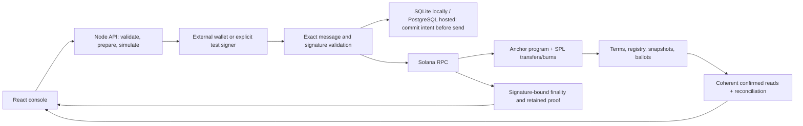

# BondTrace

[English](README.md) · **Русский**

Корпоративные действия для токенизированных облигаций на **Solana**: определить держателей, зафиксировать права, рассчитать выплаты, исполнить расчёты и сохранить проверяемый результат. Проект для трека **Superteam Kazakhstan × KASE**.

## Открыть рабочее приложение

**[Приложение в devnet](https://bondtrace-devnet.onrender.com/)** · **[Завершённый выпуск](https://bondtrace-devnet.onrender.com/?view=payments&instrument=2KWpyE9mQWS6VTviCJFi1b4Zh55rti9xeDS6yk37sU7Y)** · **[Ончейн-аккаунт](https://explorer.solana.com/address/2KWpyE9mQWS6VTviCJFi1b4Zh55rti9xeDS6yk37sU7Y?cluster=devnet)**

Для просмотра держателей, выплат, голосования и квитанций установка и пароль сайта не нужны. Приложение читает настоящие devnet-аккаунты; у каждой выполненной ончейн-операции есть подпись транзакции. Подключение кошелька не даёт прав эмитента или другого держателя.

Сервис работает на **Render Free + Neon PostgreSQL**, байты Solana-программы проверяются по хешу. Активы — тестовые SPL-токены без фиатной стоимости. Бесплатные сервисы могут засыпать или достигать квот RPC; при недоступных чтениях действия блокируются, успешная выплата не выдумывается.


*Снимок публичного приложения после проверенного цикла и перезапуска 9 октября 2026: выплачены 900 тестовых единиц. На снимке кошелёк подключён; проверка пользовательской подписи имеет отдельные границы ниже.*

## Что реализовано

| Требование KASE | Работающая реализация | Доказательство / код |
|---|---|---|
| Тестовый инструмент | Classic SPL mint, целые облигации, номинал, погашение и даты купонов; неизменяемые ставка/частота через `FinancialTerms` | [Программа](programs/bondtrace/src/lib.rs), [release](programs/bondtrace/release.json) |
| Реестр держателей | Эмитент регистрирует до 16 адресов и размещает облигации в canonical token accounts | `register_holder`, `issue_units` |
| Record date | Наступившая незафиксированная дата блокирует переводы; снапшот навсегда сохраняет количество; последующий перевод/burn не меняет купонные права | `capture_coupon`, `Coupon.units` |
| Entitlements | Целочисленная математика с проверками, точные суммы и reconciliation | [Client math](packages/client/src/domain.ts), [технический обзор](TECHNICAL.md) |
| Купон | SPL transfer фиксированному получателю; claim держателя или settlement исполнителем; общий paid mask исключает двойную выплату | `claim_coupon`, `settle_coupon`; батчи до четырёх получателей |
| Погашение | Снапшот при maturity, перевод номинала и burn облигаций в одной атомарной транзакции; повторное погашение отклоняется | `begin_redemption`, `redeem_principal` |
| Дополнительное действие | Голосование с фиксированными весами; один голос держателя | `create_vote`, `cast_vote`, Proposal/Ballot accounts |
| Ончейн-результат | Аккаунты программы, подписи, наблюдаемая finality и сохранённые execution proofs | [26 транзакций хостинга](docs/evidence/hosted-devnet-20261009.json), [API](docs/15-API-CONTRACT.md) |

Для выпуска с годовой ставкой:

```text
купон_на_облигацию = номинал × rateBps / (10 000 × частота)
купон_держателя    = количество_на_record_date × купон_на_облигацию
номинал_держателя = количество_на_maturity × номинал

10 облигаций × 1000 × 10% ÷ 2 = 500 купона
10 облигаций × 1000 = 10 000 номинала
```

Bond decimals — **0**, settlement decimals — **6**. Денежные значения в JSON передаются целочисленными строками, клиент использует BigInt. Rate creation отклоняет условия, не дающие точного купона в минимальных единицах, вместо скрытого округления обещанной суммы. Даты выплат задаются явно; day-count convention не подразумевается.

## Проверенные результаты

| Проверка | Зафиксированный результат |
|---|---|
| Настоящий hosted devnet-цикл | **26 разных finalized-транзакций**: 22 корпоративные операции + 4 подготовительные |
| Выплаты и погашение токенов | **900 купонов / 18 000 номинала / 18 облигаций сожжены**; остаток обязательств, supply и резерв — **0** |
| Независимость record date | Перевод изменил текущие балансы **10/5/3 → 10/4/4**; купонные и голосующие веса остались **10/5/3** |
| Пример задания и голосование | Первый держатель получил **500 купона + 10 000 номинала**; голоса **13 за / 5 против** |
| Негативные сценарии | Чужой эмитент, недостаточный резерв, ранняя фиксация, повторный купон и повторное погашение отклонены |
| Перезапуск хостинга | Те же **22 ID и 26 подписей/proofs**, права, условия и суммы восстановлены только GET-запросами |
| Backup | Скачанная БД **204 800 байт** прошла hash/integrity check; live restore не заявляется |
| Тесты приложения/UI | **288 Node passed, 0 ошибок, 10 optional PostgreSQL skipped; 52 UI passed** |
| Отдельные program/database серии | **3 Rust unit + 16 SBF/SPL runtime, включая 64 последовательности**; **43 PostgreSQL-теста без пропусков**, в своих исторических срезах |

Все подписи, source hashes, proofs, неудачные попытки и восстановление: [доказательства хостинга](docs/evidence/hosted-devnet-20261009.json), [deployment](docs/33-HOSTED-DEPLOYMENT.md), [история проверок](docs/VERIFICATION-HISTORY.md). Результаты разных прогонов не складываются и не выдаются за одну свежую проверку.

## Воспроизвести настоящие транзакции локально

Клонировать с GitHub-аккаунтом, которому выдан доступ к приватному репозиторию:

```powershell
git clone https://github.com/dimik98330/solana-worldsfair-2026.git
cd solana-worldsfair-2026
npm ci --ignore-scripts
npm run setup:judge
npm run demo:lifecycle
```

Полный проверенный launcher использует **Windows x64, PowerShell 7, Node 22.14.0 и Ubuntu 24.04 x64 в WSL2**. Сначала установить эти prerequisites. `setup:judge` проверяет/загружает закреплённый toolchain; **на подготовленном компьютере `npm run demo:lifecycle` — сквозная демонстрация одной командой**. [Подробная установка, другие distributions/порты и recovery](docs/LOCALNET-SETUP.md).

Команда собирает программу/приложение, запускает отдельный Solana validator, выпускает и распределяет облигации, фиксирует права, выплачивает купоны, проводит голосование, погашает/burn и выводит настоящие подписи с уникальным evidence-файлом. Ожидаются реальные даты сети. Тестовые подписанты и активы генерируются; ключ владельца не нужен.

Локально: приложение/API **[127.0.0.1:3160](http://127.0.0.1:3160)**, RPC **8959**. При прерывании сохранить ID. Bootstrap продолжает свой прежний ID; новый запуск финансового demo создаёт новый выпуск. **Не перезапускать финансовый driver вместо восстановления неизвестной подписанной выплаты:** сначала проверить её прежнюю операцию/подпись.

WSL нужен этому Windows-launcher для сборки/запуска Solana, а не для просмотра сайта или hosted Node. Native macOS/ARM и холодная установка на другом физическом компьютере отдельно не проверены.

## Архитектура backend



Solana определяет финансовый результат. Внешний журнал обеспечивает discovery, exact-message relay и recovery. Signed bytes, подпись и lifetime сохраняются до отправки. PostgreSQL требует подтверждённого COMMIT и блокирует заменённого writer; неопределённый commit останавливает новые отправки. GET recovery не отправляет транзакций. Явный rebroadcast использует только прежние bytes с проверками genesis/release/expiry. Неизвестный результат не разрешает новую подпись выплаты.

Whole-event coordinator закрепляет manifest/child IDs и ограничивает каждый resume. Номинал остаётся holder-signed. Финансовое исполнение, finality отдельных транзакций и aggregate provenance родительской операции разделены; общая подпись не выдумывается.

## Запустить тесты

```powershell
npm test
npm run test:ui
npm run build
npm run test:program
node scripts/write-program-release.mjs --check
```

`npm test` проверяет client/API/storage; optional database cases пропускаются без отдельной настроенной PostgreSQL-fixture. Program tests исполняют скомпилированный SBF вместе с SPL. [Linux CI](.github/workflows/backend-verify.yml) запускается вручную; его удалённое исполнение не заявляется. `npm run verify:source` отдельно воспроизводит исходники/lifecycle и создаёт новые тестовые транзакции.

## Хостинг, кошельки и границы

[Hosting EN/RU](docs/31-HOSTING.md): бесплатный Render native Node + Neon, точный origin, проверяемый TLS, один API writer, отключённые автоматические demo-подписи и операторские backup/readiness. Приватные ключи эмитента/держателей/deployment не размещаются на сервисе. У бесплатного хостинга есть квоты/ограничения доступности; сохранять внешнюю backup-копию.

Wallet Standard требует выбранную сеть, версию транзакции и `solana:signTransaction`. Phantom обнаружен, подключён, симуляция прошла; после сообщённого владельцем одобрения вернулся `Unexpected error` до API submission. **Диагностика завершена, успешная подпись Phantom не подтверждена:** [точный результат](docs/evidence/hosted-wallet-check-20261009.json). Обязательные Solana-действия отдельно исполнены внешними криптографическими тестовыми подписантами. Обход через sign-and-send не добавлялся.

Реализованы восемь ончейн-требований, долговечный backend, точная сверка и EN/RU-интерфейс. Симулируются расчётная валюта, тестовые личности и ускоренные сроки. Bank/KASE API, юридический реестр бумаг, custody/KYC не интегрированы. Границы: 16 держателей, 8 купонов, 4 получателя в атомарном батче, окно обнаружения 32 proposals, целые облигации, полное предварительное финансирование, открытие погашения эмитентом, отсутствие вывода избытка резерва и зависимость от RPC/history/authority расчётного токена.

Владелец записывает финальное видео и управляет доступом жюри, регистрацией и отправкой. Технические доказательства не подтверждают принятие организатором или eligibility.

## Документация и исходники

| Документ | Назначение |
|---|---|
| [Гид жюри](docs/JURY-GUIDE.md) | Порядок просмотра, доказательства и границы подачи |
| [TECHNICAL.md](TECHNICAL.md) | Record date, формулы, settlement, authority и recovery |
| [API contract](docs/15-API-CONTRACT.md) | Запросы, точные строки и same-ID recovery |
| [Hosting](docs/31-HOSTING.md) / [deployment](docs/33-HOSTED-DEPLOYMENT.md) | Настройки и настоящий public lifecycle/restart |
| [История проверок](docs/VERIFICATION-HISTORY.md) | Раздельные исторические source/test cohorts |
| [Текущая готовность](docs/release/PROJECT-READINESS-20261009.md) | ProofPilot coach review проекта и README, не официальный балл |

Исходники: `programs/bondtrace` — Anchor/SBF; `packages/client` — инструкции/BigInt; `server` — API/journal/recovery/proofs; `apps/web` — React; `tests` — регрессии; `scripts` — setup/verification/demo. Ключи, копии БД, runtime output, зависимости и сырые записи не входят в Git. Исторические proofs/media сохраняют свой первоначальный scope.
