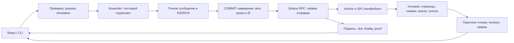

# BondTrace

[English](README.md) · **Русский**

Корпоративные действия для токенизированных облигаций на **Solana**: определить держателей → зафиксировать права → рассчитать выплаты → исполнить расчёты и погасить токены → сохранить проверяемый результат. Проект для **Superteam Kazakhstan × KASE**.

**[Открыть devnet-приложение](https://bondtrace-devnet.onrender.com/)** · **[Завершённый выпуск](https://bondtrace-devnet.onrender.com/?view=payments&instrument=2KWpyE9mQWS6VTviCJFi1b4Zh55rti9xeDS6yk37sU7Y)** · **[Explorer](https://explorer.solana.com/address/2KWpyE9mQWS6VTviCJFi1b4Zh55rti9xeDS6yk37sU7Y?cluster=devnet)** · **[Техническое описание](TECHNICAL.md)**

## Что можно проверить

Сайт читает настоящие devnet-аккаунты и квитанции. Он работает на Render Free с постоянной базой Neon PostgreSQL. Для обычного просмотра пароль сайта не нужен. Активы и расчётные балансы — **тестовые SPL-токены без фиатной стоимости**. Бесплатный хостинг может засыпать; при ошибке RPC действия блокируются, идентификаторы восстановления сохраняются.

| Версия | Область подтверждения |
|---|---|
| Публичный devnet | Программа v3, SHA `761b993d…077bdfd`; 10 октября развёрнут wallet-only сервис `e658553`. Завершённый цикл, 26 finalized-транзакций, перезапуск и backup. [Доказательства](docs/33-HOSTED-DEPLOYMENT.md). |
| Текущий код v4 | Постраничные аккаунты, обслуживание погашения без эмитента, новые получатели после активации, подписанные адаптеры. SBF SHA `ee2bb0f7…8f1ee12`; локальные проверки указаны отдельно. |
| Обычный Phantom | Подключение наблюдалось; sign-only транспорт и проверка точного сообщения реализованы и протестированы. Успешная транзакция человека через Phantom **пока не подтверждена**. |
| Внешние организации | Адаптер реестра/расчётов и теневая сверка реализованы. Интеграция или поддержка со стороны KASE, банка, кастодиана либо заказчика не заявляются. |

Сервер v4 требует соответствующий образ программы. Нельзя подключать его к старой публичной программе, обходя проверку хеша. Публикация кода не обновляет Solana-программу. Отдельный wallet-only deploy сервиса v3 проверен 10 октября по фактическому JS-asset, хешу программы, PostgreSQL и прежнему завершённому выпуску. [Дополнение с версиями](docs/evidence/wallet-buffer-check-20261010.json).


*Настоящее публичное приложение, снимок 9 октября 2026 года. Историческое доказательство v3; подключённый кошелёк не подтверждает успешную подпись транзакции.*

## Функциональность

| Требование KASE | Реализация в текущем коде | Код |
|---|---|---|
| Тестовый инструмент | Classic SPL mint; целые облигации; неизменяемые номинал, ставка, частота, погашение и купонный календарь | [BondV2 и страницы](programs/bondtrace/src/v2_state.rs) |
| Реестр | Канонические PDA/ATA; страницы по 8 записей. Между блокировками эмитент может добавить нулевого получателя после активации | [Программа](programs/bondtrace/src/v2.rs) |
| Record date | Наступившая незафиксированная дата блокирует переводы; capture/finalize закрепляют длину реестра и количества | `begin_coupon_v2`, `capture_action_page_v2`, `finalize_action_v2` |
| Расчёт прав | Целочисленная математика с проверкой overflow; контроль ставки; без float и скрытого округления | [Математика](packages/client/src/domain.ts), [контракт v4](docs/34-PAGED-SERVICING.md) |
| Купон | SPL-перевод фиксированному получателю: claim держателя или settlement исполнителя; общая маска против дубля | `claim_coupon_v2`, `settle_coupon_v2` |
| Погашение | Любой плательщик комиссии открывает наступившую фиксацию; держатель атомарно получает номинал и сжигает облигации | `begin_redemption_v2`, `redeem_principal_v2` |
| Доп. действие | Голосование с весом из неизменяемого снимка, один голос держателя | `create_proposal_v2`, `cast_vote_v2` |
| Ончейн-результат | Аккаунты действий/снимков/бюллетеней, суммы и маски; подписи, наблюдаемая finality и execution proofs | [API](docs/15-API-CONTRACT.md), [devnet-proof](docs/evidence/hosted-devnet-20261009.json) |

В v4 исчезновение эмитента не блокирует купонную фиксацию и открытие погашения. Предыдущие купонные снимки должны быть завершены — это может сделать любой плательщик комиссии. Сжигание/номинал подписывает соответствующий держатель. Исполнитель не выбирает другого получателя.

```text
Купон за облигацию = номинал × rateBps / (10 000 × частота)
Купон держателя    = количество в снимке × купон за облигацию
Номинал           = количество на погашение × номинал

10 × 1 000 × 10% ÷ 2 = 500 купона
10 × 1 000           = 10 000 номинала
```

Decimals облигации — **0**, расчётного токена — **6**. TypeScript считает через BigInt, JSON передаёт целые суммы строками, Rust использует checked integers. Остаток меньше минимальной единицы отклоняется. Частота — годовой делитель; явные даты не подразумевают выдуманную day-count convention.

## Быстрый запуск с настоящими транзакциями

```powershell
git clone https://github.com/dimik98330/solana-worldsfair-2026.git
cd solana-worldsfair-2026
npm ci --ignore-scripts
npm run setup:judge
npm run demo:paged:lifecycle
```

Нужны **Windows x64, PowerShell 7, Node 22.14.0, WSL2 с Ubuntu 24.04 x64**. `setup:judge` проверяет/загружает закреплённые Rust 1.91.0, Agave 3.1.10 и Anchor 1.1.2. Первая установка/компиляция дольше прогретого запуска. [Настройка, native Linux, другой дистрибутив и восстановление](docs/LOCALNET-SETUP.md).

На подготовленной машине **`npm run demo:paged:lifecycle` — одна команда**: сборка → отдельные validator/API → тестовый mint/выпуск → распределение 10/5/3 → фиксация прав и голосование → новый получатель/перевод → купоны → номинал/burn → поздний claim старого купона → итоги/подписи. Голоса подаются до погашения, результат остаётся после него. Используются реальные сроки chain clock и созданные локальные тестовые ключи; ключ пользователя не нужен.

Постраничный лаунчер: **сайт/API `http://127.0.0.1:3200`, RPC `http://127.0.0.1:8999`**. Старый `npm run demo:lifecycle`: 3160/8959. Разные релизы получают отдельные native ledger и игнорируемые пространства метаданных. Чужие занятые порты и несовпадающие образы отклоняются.

Увеличенный сценарий из подготовленной копии:

```powershell
pwsh -NoProfile -File scripts/lifecycle-demo.ps1 -Paged -Scale33 -LateCoupon -RpcPort 8999 -ApiPort 3200
```

Он запрашивает **33 исходных держателя, 34-го получателя и 9 купонов**, сохраняет группы транзакций. Выводит recovery ID, неизменяемый launcher plan, адрес API и каталог публичных доказательств. Это проверочный сценарий, а не production-бенчмарк.

При остановке сохраните data directory, ID, даты и подписи. Продолжайте с **теми же флагами и `-OperationId <напечатанный-id>`**. Сначала проверяются прежние подписи. Неизвестный результат останавливает отправку; нельзя удалять журнал или создавать заменяющий платёж. Новый ID означает новый тестовый выпуск.

WSL нужен для Solana-компиляции и локального validator на Windows. Для просмотра сайта и hosted Node WSL не требуется. Native macOS/ARM и установка на другом физическом компьютере отдельно не проверялись.

## Использование вручную

1. На публичном сайте доступны выпуск, реестр, купоны/номинал, голоса и квитанции. Ссылка Explorer в квитанции позволяет проверить подпись.
2. Подключите кошелёк, например Phantom. Подключение не передаёт права эмитента или другого держателя. Комиссии оплачиваются тестовыми devnet SOL; mainnet не поддерживается.
3. В localnet v4 с совпадающим образом форма поддерживает годовую ставку/частоту либо фиксированный календарь. Заполните даты, расчётный mint и условия, проверьте и подпишите транзакцию. Перед активацией нужны реестр, размещение и полный резерв.
4. Любой аккаунт может оплатить наступившую фиксацию. Большой снимок продолжается по страницам в панели операций. Держатель получает свой купон или подписывает погашение; исполнитель платит купоны только фиксированным получателям.

Автодемо использует тестовых подписантов. Обычная подпись Phantom остаётся открытой проверкой до сохранения успешной транзакции. Исправленный v0-путь использует Wallet Standard с полной транзакцией; legacy injected-запросы остаются отдельными. Включите **Phantom → Настройки → Настройки разработчика → Testnet Mode → Solana Devnet**; комиссии оплачиваются бесплатными тестовыми SOL. Баланс mainnet не оплачивает devnet. При недостаточном балансе или ошибке симуляции отмените запрос, обновите даты примера и подготовьте новый review; не подтверждайте небезопасный запрос ради завершения демо. Для приёмки нужны сохранённая подпись, подтверждение сети и ожидаемый аккаунт выпуска. Sign-only отправляет через тот же журнал; после неудачного запроса нет скрытого переключения на wallet broadcast.

## Архитектура и бэкенд



- **Solana** определяет права, выплаты и погашение. API проверяет канонические аккаунты и точно сверяет supply/обязательства; противоречивое состояние отклоняется.
- **Локальная SQLite**: журнал с DELETE/EXTRA, проверенный rollback, межпроцессные блокировки, защита путей и restart recovery. `STORAGE_BUSY` сохраняет неопределённость, а не становится подтверждением.
- **Hosted PostgreSQL**: подтверждённый COMMIT, проверенный TLS и fencing поколений writer. Неопределённый commit блокирует новую подпись/отправку; перехода на пустую локальную БД нет.
- **Восстановление**: GET ничего не отправляет. Confirmed-chain/pending-projection восстанавливается по прежнему ID. Явный rebroadcast допускает только сохранённые байты с проверкой релиза/genesis/срока.
- **Адаптеры**: подписанные Ed25519-сведения реестра, точные неизменяемые инструкции, outbox по держателям, подписанные ответы, replay/conflict проверки и audit export. По умолчанию отключены. Shadow-ответ не меняет ончейн paid bit и не разрешает банковский платёж.

Подробнее: [v4](docs/34-PAGED-SERVICING.md), [API](docs/15-API-CONTRACT.md), [адаптеры](docs/integrations/PILOT-CONTRACT.md), [pilot runbook](docs/integrations/PILOT-RUNBOOK.md), [хостинг](docs/31-HOSTING.md).

[Готовность и четыре замечания](docs/35-READINESS.md): ограниченный технический отчёт прошёл ProofPilot coach evidence checks; это не официальная оценка и не подтверждение обычного кошелька/внешнего партнёра.

## Проверки

| Прогон | Наблюдаемый результат |
|---|---|
| Публичный v3 devnet, 9 октября | **26 finalized-транзакций**; **900 купонов / 18 000 номинала / 18 burned**; обязательства/supply/vault **0** |
| Публичный record date | Текущие 10/5/3 → 10/4/4; права 10/5/3. Первый держатель **500 + 10 000**, голоса **13/5** |
| Публичный restart/backup | Прежние 22 business ID/26 подписей восстановлены через GET; portable DB 204 800 байт проверена по integrity |
| Текущая программа v4 | SBF-сборка, **3 unit + 20 SBF/SPL runtime-тестов** прошли, включая 64 последовательности и 33→34 держателя/9 купонов |
| Настоящий v4 RPC/localnet цикл | **33 → 34 держателя, 9 купонов, 253 транзакции**: 215 операций инструмента/обслуживания + 38 вспомогательных. **21 600 купонов / 48 000 номинала / 48 burned**, supply/vault/обязательства0; открытие погашения без эмитента; старый купон 500 получен после burn |
| Настоящий подготовленный запуск одной командой | Отдельный цикл 3 → 4 держателя / 2 купона прошёл; **37/37 подписей заново проверены finalized**, 1 800 купонов / 18 000 номинала / 18 burned и нулевые supply/vault/обязательства. [Независимая проверка HTTP/RPC](docs/evidence/servicing-v4-one-command-check-20261010.json), [полный отчёт](docs/evidence/servicing-v4-one-command-20261010.json) |
| Исправление кошелька с v4, изолированный GitHub CI | [Merge-checkout PR3, успешный run](https://github.com/dimik98330/solana-worldsfair-2026/actions/runs/38035694642): **356 Node прошли, 0 ошибок, 10 optional PostgreSQL пропущены; 93 UI прошли**. Независимая сборка SBF совпала с хешем v4; повторно прошли 3 Rust unit / 20 runtime. Этот run не включает более поздний BUFFER-инструмент |
| Свежая disposable PostgreSQL | **40 прошли, 0 ошибок, 3 TLS-fixture пропущены**, PostgreSQL16.15. Это отдельная БД/job того же кода/run; plain fixture не подтверждает TLS |
| Текущая storage | Отдельно проверены реальные процессы, cold-open contention, namespace/symlink guards, bulk reads, same-ID projection recovery; полный прогон привязан к версии |
| Адаптер на настоящем localnet v4 | Право **500 000 000** base units; подписанный shadow/replay пережил restart API; финансовый граф не изменён; банк не вызывался |
| Подготовка BUFFER, отдельная проверка | **29 целевых тестов прошли**, typecheck/build прошли; независимый критик принял repair1. Записанный localnet-буфер 2701 байт остановлен после 2 подписанных транзакций, затем тот же журнал/буфер продолжен до 5 различных транзакций и finalized-хеша байтов. Программа не изменилась. Это не полный upload/devnet/upgrade |
| Core + кошелёк + BUFFER, полный main CI | [Код `d100f1c`, успешный run](https://github.com/dimik98330/solana-worldsfair-2026/actions/runs/38053587760): **385 Node прошли, 0 ошибок, 10 optional PostgreSQL пропущены; 93 UI прошли; 3 Rust unit / 20 SBF runtime прошли**. Образ v4 пересобран с точным хешем; отдельный PostgreSQL — 40 прошли / 3 TLS-fixture skips. Более поздняя Windows-проверка владельца runtime-процесса проведена отдельно |
| Восстановление прежнего ledger после сбоя | Пустой повреждённый snapshot изолирован с backup, прежний ledger возобновлён. **37 исходных ID/подписей восстановлены через GET**; финансовый граф прежний: купоны 1 800 / номинал 18 000 / 18 сожжено, обязательства ноль. Свежие RPC-статусы всех 37 старых подписей недоступны; прежние finalized-наблюдения сохранены отдельно. [Проверка восстановления](docs/evidence/localnet-recovery-check-20261010.json) |
| Историческая БД | **43 PostgreSQL-теста** с TLS fixture прошли на своей версии; это не свежий CI текущего кода |

[История проверок](docs/VERIFICATION-HISTORY.md) · [CI](docs/integrations/CI-VERIFICATION.md). YAML workflow сам по себе не означает зелёный remote run. Счётчики разных прогонов не складываются. Неудачные попытки сохраняют исходную область доказательств.

Начальные полные локальные прогоны падали на своих версиях; старый serial cut остановлен со 143 наблюдаемыми pass / 3 timeout в fixture. Эти записи сохранены. Последующий зелёный изолированный run проверяет текущий код и не превращает прошлые сбои в успешные проверки.

[Краткие итоги v4](docs/evidence/servicing-v4-localnet-summary-20261010.json) · [Все 253 transaction proofs, 1,68 МБ](docs/evidence/servicing-v4-localnet-20261010.json) · [Программа/CI/shadow-адаптер](docs/evidence/servicing-v4-verification-20261010.json). Архив цикла содержит 247 finalized и 6 confirmed наблюдений; поздний пассивный запрос не нашёл 75 старых статусов. [Ограничение истории](docs/evidence/servicing-v4-history-observation-20261010.json) сохранено; все 253 не объявляются заново finalized. Отдельное свежее чтение API подтвердило revision 496 и нулевые обязательства. Постоянные аккаунты действий и сохранённые transaction proofs — отдельные основания проверки.

Отдельный 37-транзакционный запуск использовал `-SkipBuild` с проверенным SBF и отдельно успешно пересобранным UI. Сохранены исходные 180/180/60 секунд chain time; не потребовались retry, замена ID или запрос кошелька. Это проверка подготовленного лаунчера; установка с нуля на чужой машине отдельно не подтверждена.


*Подготовленный localnet v4, 10 октября 2026: выплачено 18 000 номинала, первому держателю 10 000. Тестовые подписанты; отдельно проверены 37 свежих finalized-подписей. Прогретый лаунчер занял 10:41 плюс 24 секунды сборки UI на этом компьютере.*

```powershell
npm run typecheck
npm test
npm run test:ui
npm run build
npm run test:program
npm run test:integration-verifier
# Только отдельная disposable PostgreSQL; wrapper отклоняет application DB:
npm run test:postgres
```

Проверяются 500/10 000, остаток/overflow, неизменяемость снимка, переводы после record date, нулевые позиции, authority/date/reserve ошибки, двойной купон/номинал/голос, неполная фиксация/restart, frozen vault, границы страниц, купон после burn, конфликт ID, database crash/неопределённый COMMIT. Тесты: [tests](tests), [UI-модели](apps/web/src).

## Ограничения и путь к пилоту

V4 заменяет массивы **16 держателей / 8 купонов** страницами по 8 записей и u32-счётчиками. Масштаб проверен в ограниченной области: полное чтение API — **4 096 account observations**; браузерное создание — **16 купонов на транзакцию**, более длинный календарь с увеличенным declared count создаётся/добавляется через API или CLI, без браузерного append-контрола. История предложений имеет явные пределы discovery. [Точные границы](docs/34-PAGED-SERVICING.md#explicit-limits--явные-границы).

Classic SPL-счета заморожены вне контролируемых переводов ради record date. Обычные SPL/DEX-переводы не поддерживаются. Целые облигации, полное предфинансирование, явные даты, upgrade authority, freeze authority расчётного mint и доступность/история RPC остаются предпосылками. Голосование автоматически не меняет юридические условия.

Адаптер — реализованная граница пилота. Для внешней приёмки нужны конкретный реестр/кастодиан, доверенные ключи/mappings, банковская sandbox, подписанная сверка и ответственные за операции/право. Интервью, партнёрства, спрос, регуляторное одобрение и официальная оценка не выдумываются.

Private keys, .env, БД, signed intents и browser/auth state игнорируются. Сохраняйте отдельные backups метаданных. Регистрация, финальная заявка и загрузка видео остаются действиями владельца.


## Отчёт и документация

`npm run report` создаёт **офлайн HTML-отчёт по сохранённым проверкам** и манифест SHA-256 в игнорируемой `.local/reports`, проверяет согласованность файлов цикла и печатает путь. Команда не обращается к сети и не подписывает транзакции; это не новая проверка доступности/finality. [Карта документации](docs/README.md) · [Актуальный API](docs/15-API-CONTRACT.md) · [Безопасность](docs/11-SECURITY.md) · [Публикация/история](docs/PUBLICATION.md).
