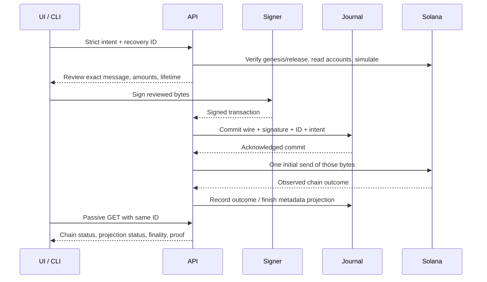

# Technical overview — BondTrace v4

[English README](README.md) · [Русский README](README.ru.md) · [Paged protocol contract](docs/34-PAGED-SERVICING.md)

## Scope and versions

The authoritative financial component is an Anchor program on Solana. Bond tokens use classic SPL Token with decimals0; a mock SPL settlement mint uses decimals6. Test tokens simulate a cash rail, while entitlement, transfer, burn and one-time claim logic execute in the actual Solana runtime.

Current additive release: `paged-corporate-actions-v4`,959536-byte SBF payload, SHA256 `ee2bb0f7eef91f04722b4b9f834d58d3bc4dc2fc3f76905dfc1d7521f8f1ee12`. Older layouts/instructions remain available. New issues use separate v2 discriminators/PDA seeds, without rewriting old registries or snapshots.

The public devnet program `B3aFCQ25iN3gjmvznAaY5RNnnw8J5ihFPsPoGgWXhmb8` still has the recorded v3 payload541456B/SHA `761b993d403ae03a84e94475404299b0d4e798a6ea2d17ae44e003148077bdfd`. Local v4 evidence does not establish its public upgrade. A matching-release check fails closed before financial preparation/relay.

## Components and data flow

| Path | Responsibility |
|---|---|
| `programs/bondtrace/src/{v2,v2_state,v2_contexts}.rs` | Account/state model, account constraints, corporate-action state machine and SPL CPIs |
| `packages/client/src/program.ts` | Instruction encoding, canonical PDA derivation, account decoding |
| `packages/client/src/domain.ts` | Exact integer domain calculations |
| `server/v2.ts`, `v2-contract.ts` | Batched graph reading/reconciliation, strict action parameters |
| `server/{actions,transactions,effects}.ts` | Prepare/simulate, exact relay, durable projection recovery |
| `server/{storage,journal,operations}.ts` | Local SQLite/hosted PostgreSQL journal and recovery IDs |
| `server/integrations.ts` | Signed registry and nonexecuting shadow-settlement boundary |
| `apps/web/src` | React issuer/holder workspace, signing/recovery and page controls |
| `scripts/paged-demo.ts` | Actual local RPC lifecycle with fixed plans, generated signers and retained signatures |
| `tests/program` | Compiled SBF execution with real SPL CPIs in LiteSVM |



## Accounts and state transitions

| Account | Contents | Allocation including discriminator |
|---|---|---|
| BondV2 | Issuer, mint/vault, immutable nominal/rate/frequency/maturity, supply, counts, phase, revision |319B|
| HolderV2 | Bond, immutable wallet/index and bump; quantity is read from the canonical SPL ATA |77B|
| RegistryPageV2 | Bond/page identity, up to8 indexed holder addresses |305B|
| SchedulePageV2 | Bond/page identity, up to8 coupon terms |241B|
| ActionV2 | Coupon/principal/vote kind+ID, fixed registry prefix, capture state, totals and deadlines |235B|
| SnapshotPageV2 | Fixed quantities for8 historical indices; claim/vote masks |123B|
| BallotV2 | Bond/proposal/holder identity, fixed weight, choice |82B|

Draft: append ordered future coupon terms, register holders, issue units, fund reserve. Activation requires complete schedule, positive supply, exact mint/holder supply consistency and sufficient full principal+coupon reserve in a spendable vault. An active issue cannot mint extra supply or change annual terms.

After activation the issuer may append a zero-balance receiver between record locks. Existing indices/wallet identities never move. No receiver is granted a past entitlement: each action has already fixed its holder-count prefix. Transfers move current units through the program; total supply remains constant until principal burn.

Any fee payer can open a due coupon or maturity capture. Captures advance by exact next page and finalize only after full supply reconciliation. Coupon claims wait for finalization and payment time. Maturity requires all preceding coupon snapshots finalized, then fixes current quantities. Each holder's principal transfer and corresponding burn are atomic. Principal retirement and all-obligations-settled are distinct states.

The issuer opens a voting proposal before maturity. Anyone can complete its already-open capture, including after ballot deadline/maturity. Votes are accepted only while eligible and open, with fixed snapshot weight and one ballot. Informational voting does not implement quorum or automatic legal-term changes.

Legacy `begin_redemption` also accepts a nonissuer executor with canonical maturity checks; its wire/account layout is preserved. New scalable issues use the separate v2 instructions.

## Record-date correctness

A due uncaptured coupon record blocks transfers. Opening capture locks transfers and registry appends until finalization. Pages are captured in order; duplicate/skipped pages or incomplete finalization fail. Finalization verifies captured quantities equal outstanding supply. Therefore a delayed capture observes protected cutoff balances, rather than freely changing positions after the date.

Snapshot quantities/terms are immutable after creation. Later transfers, new receivers and principal burns do not alter old coupon/vote rights. Only settlement masks/totals change under checked program rules. Zero balances do not create payable rights.

Classic SPL ATAs remain frozen outside program-controlled thaw→transfer/burn→refreeze operations. Canonical mint/owner/ATA, token state, absence of delegate/custom close authority and program PDA relationships are checked. This is a deliberate transfer-control policy; ordinary SPL/DEX transfers are unsupported. Freeze authority of the separate settlement mint and upgrade authority remain disclosed trust dependencies.

## Exact entitlement and reserve math

```text
perBondCouponMinor = faceValueMinor × rateBps / (10,000 × frequency)
holderCouponMinor  = snapshotUnits × perBondCouponMinor
principalMinor     = maturityUnits × faceValueMinor
requiredReserve    = outstanding principal + every unpaid coupon obligation

faceValueMinor = 1000000000
rateBps = 1000; frequency = 2
perBondCouponMinor = 50000000
10 bonds: coupon = 500000000; principal = 10000000000
```

Financial inputs/outputs are u64 base units or decimal strings. Intermediate Rust multiplication uses checked u128; final conversions/additions and TypeScript BigInt bounds reject overflow. A nonzero division remainder is rejected, not silently rounded. Annual terms and every declared coupon amount must agree on-chain, even for direct calls bypassing the API. Fixed/irregular legacy schedules remain explicitly fixed.

The UI exposes annual-rate/frequency calculation and explicit fixed mode. Frequency is the annual divisor; payment/record dates are independently ordered explicit timestamps. Accelerated demo dates are test dates, without a program clock bypass or invented business-calendar convention.

Coupon holder claim and executor settlement share one paid bit for holder/event. Permissionless settlement always uses the canonical beneficiary and contract amount. A failed transfer rolls back the bit and totals. Principal burn/payment has the same atomicity: failed payment restores token supply, holder balance and masks. Coupon rights remain claimable after principal retirement.

## Account validation and reads

All instructions enforce signer/issuer or holder authority, canonical PDAs/bump/seeds, account owner/mint/state, action kind/ID, phase/date, nonzero/range constraints and checked arithmetic. Admin operations cannot be authorized by HTTP role text. The program increments BondV2 revision on every economic mutation.

The v2 API discovers and reads accounts in batches of at most100, with a total4,096-account observation budget. It checks Bond revision before/after and retries a changing graph at most3 times. Responses disclose the slot interval and `sameBank:false`. External SPL observations are not misrepresented as one atomic bank snapshot. Fresh simulation and on-chain revalidation still precede execution.

Reconciliation checks mint/current registry supply, outstanding versus redeemed units, captured quantities, paid/voted masks, exact principal/coupon totals, canonical beneficiary accounts and reserve gaps. Missing selected instruments, owners, pages or contradictory data fail closed; no zero-filled financial fixture replaces them.

Scoped page GETs: `/api/v2/instruments/:bond/pages/{registry|schedule|snapshot}/:page`. Snapshot reads require explicit action kind/ID. A scoped page is inspection, not a complete reserve/reconciliation certificate.

Protocol counts are u32 with8-entry pages. Whole-view API budgets, wire1232B, browser creation16coupons, local catalog250issues and bounded history discovery are practical limits. Proposal metadata retains512 IDs/128 optional labels with sticky truncation flags; current/required financial actions remain included or the read fails. On-chain records and journal entries are retained.

## Durable relay, idempotency and recovery

Prepared messages bind wallet, action/parameters, accounts, exact amount, genesis, reviewed program hash and transaction lifetime. Signed wire/message must match exactly; all required Ed25519 signatures are verified. Wallet account/version/lifetime are checked before relay. The Phantom sign-only path is selected before prompting and has no automatic broadcast/fallback loop.

The journal commits intent, canonical signed bytes, signature, lifetime and ID before any initial send. Same ID with different intent conflicts. Chain confirmation and metadata projection are separate. V2 confirmed transactions cannot be marked projection-complete before their catalog effects finish. A fresh GET can recover the same confirmed signature after a crash without resending.

Local SQLite uses DELETE journal, synchronous EXTRA, verified transactions/rollback and busy timeout5000ms. Initialized cold readers inspect schema/integrity without reserving a writer lock. Schema migration rechecks inside the atomic writer transaction. Ancestor and SQLite/sidecar filesystem guards are fresh on every call; no path-safety TTL is used. Bulk reads avoid per-document queries while preserving transaction and namespace checks.

A native SQLITE_BUSY becomes `STORAGE_BUSY` only after cleanup/rollback is known. Callback failure or uncertain cleanup remains fail-closed. Busy GET can return503 with original operation ID and recoveryRequired; it never invents confirmed. Tests retain actual overlapping writer contention. Suite files execute serially by default to avoid unrelated fsync-heavy crash fixtures competing; internal concurrent-writer cases and deadlines remain unchanged.

Hosted PostgreSQL uses one reserved client for BEGIN–COMMIT, verified TLS/hostname and synchronous_commit=on. Staged cache publishes only after acknowledged COMMIT. Unknown commit, broken rollback or timeout poisons the process; no SQL replay/local fallback. Fresh writer-generation checks fence replaced processes before signing and sending. Keep one active writer per namespace; do not run preview deployments against production recovery tables.

GET recovery never sends. Explicit rebroadcast can send only original retained bytes after genesis/release/signature/expiry checks. Unknown/expired/pruned history does not authorize a newly signed replacement. Business status and observed processed/confirmed/finalized status remain separate. Retained proof records their source/time; unavailable history never upgrades finality.

Devnet RPC uses shared bounded admission/pacing. Read-only methods may retry429 within the original deadline; sendTransaction gets one initial HTTP attempt. No free-provider availability guarantee or multi-replica limiter is claimed.

## External integration boundary

`server/integrations.ts` accepts trusted Ed25519 registry attestations and settlement acknowledgements scoped to chain/program/instrument/action. It validates exact canonical payloads, source sequence/nonce/expiry, amounts/assets/beneficiaries and registry reconciliation. Trusted public-key policy is disabled by default; private partner keys are never server configuration.

An immutable manifest and all per-holder outboxes commit atomically. Economic payment IDs bind the historical obligation; a second request ID cannot create a second intent. Signed mismatched acknowledgements are quarantined; unknown external status stops progression. Audit exports preserve provenance and exact digests.

This is shadow/sandbox only: dispatchAllowed=false, no bank dispatcher, no token send/burn and no on-chain paid-bit mutation. An external simulated-settled response can coexist with on-chain unclaimed. [Implemented contract](docs/integrations/IMPLEMENTED-ADAPTER.md), [acceptance cases](docs/integrations/PILOT-CONTRACT.md), [pilot runbook](docs/integrations/PILOT-RUNBOOK.md).

The actual-chain verifier checks built HTTP assets, canonical deployed SBF, paged graph, exact unpaid snapshot entitlement, signed import/ack, replay, audit integrity and unchanged financial graph. Separate process restart observations bind the same ID/digest. This verifies a concrete adapter boundary, not a real bank/KASE/registry partnership.

## Reproduction and evidence

`npm run demo:paged:lifecycle` is the Windows/WSL launcher; `-Scale33 -LateCoupon` requests the larger cohort. It retains fixed batch groups, plan hashes, dates, child IDs and signatures before relay. Coupon batches contain up to4 recipients; initial issuance groups contain up to3 within one registry page; principal is individual holder-signed. Unknown outcomes stop. Resume with the saved ID/flags/data, never replacement signatures.

Program tests execute the compiled959536B SBF with real SPL CPIs in LiteSVM; some tests advance the test sysvar clock. The actual RPC demo waits for real chain time. These scopes are distinct. Offline wire measurements884/1004B and runtime measurements apply only to their recorded groups, not a throughput/SLA guarantee.

Public v3 proof:26 finalized transactions,900coupon/18000principal/18burned, supply/vault/obligations0, immutable10/5/3 despite current10/4/4, primary500/10000, vote13/5. Its actual Render restart and backup are historical evidence, preserved separately from v4.

Current verification source, test counts, failures/repairs and remaining deployment gaps belong to the README and versioned evidence. A workflow definition, written test or successful build alone is not a passed deployment. Ordinary human Phantom signing, v4 public upgrade and external partner acceptance require their own actual evidence.

## Security and operational limits

Mainnet/real funds are unsupported. This is not a production security audit, legal registry or regulated offering. Upgrade authority, settlement mint freeze authority, complete prefunding, owner-holder principal signatures and honest/available RPC remain assumptions. No automatic term amendment, quorum engine, coupon day-count adjustment, surplus withdrawal or unrestricted SPL interoperability is claimed.

Credentials/keypairs/DB/browser state remain ignored; signed wires are recovery metadata and must not be published as source artifacts. Operator backup/readiness and integration routes retain authentication/origin/body limits. Portable backup validates integrity and writes new files; no automatic destructive restore is performed. Financial journal rows are not deleted to satisfy discovery/cache budgets.
