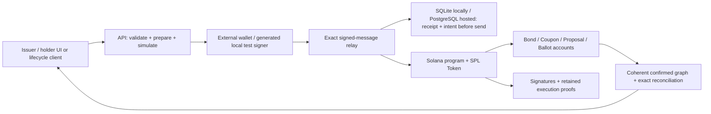

# BondTrace technical guide

Engineering scope: an existing permissioned corporate-action prototype on Solana, strengthened against the owner's eight KASE requirements on8October and hosting boundaries on9October2026. The asset and settlement currency are test SPL tokens. Fiat rails, real assets, KASE integration and production authorization are outside this implementation. Current instructions: [English](README.md) / [Русский](README.ru.md); [prepared hosting architecture and verification](docs/31-HOSTING.md).

Actual public origin: **https://bondtrace-devnet.onrender.com**. Render Free serves the UI/API; Neon PostgreSQL16.15 holds the durable public journal over verified TLS. The canonical devnet program payload is verified against release SHA761b993d403ae03a84e94475404299b0d4e798a6ea2d17ae44e003148077bdfd (541456bytes). [Deployment evidence](docs/33-HOSTED-DEPLOYMENT.md) records live lifecycle/restart results separately from historical localnet cohorts and successful wallet connection separately from human-wallet transaction signing.

[Actual hosted execution](docs/evidence/hosted-devnet-20261009.json): 26 unique finalized signatures/proofs, 22 corporate operations, 900 coupon units, 18,000 principal units, 18 burned bonds and zero supply/vault/outstanding obligations. After an actual Render restart, GET-only recovery matched all operation IDs, signatures, proofs, fixed rights and financial totals. The off-host metadata download passed SQLite integrity/hash checks. These financial actions used generated external cryptographic test signers; [the separate owner-operated Phantom attempt](docs/evidence/hosted-wallet-check-20261009.json) failed before API submission and is not counted as successful human-wallet execution.

## Launch and verification

Prepared Windows environment: Node22.14.0, PowerShell7, Ubuntu WSL, pinned Anchor1.1.2/Agave3.1.10/Rust toolchain and installed npm dependencies. Fresh dependency installation: `npm ci --ignore-scripts`. Runtime provenance and fresh-machine limits are documented in `docs/02-ENVIRONMENT.md` and `docs/research/kase-chain.md`.

```powershell
cd solana-worldsfair-2026
npm run demo:lifecycle
```

This builds the SBF and application, starts a verified release in its own local ledger/data namespace, resumes a durable bootstrap ID, and executes the lifecycle through the built HTTP origin. Default ports are API3160/RPC8959. New ledgers use a native Linux filesystem in the selected WSL distribution; generated test keys/public metadata remain in ignored `.local/`. The current host selects isolated BondTraceRuntime because its original Ubuntu VHD is unavailable. No old ledger is reset or replaced.

The command prints action signatures and a unique `docs/evidence/execution-audit-*.json` path. It waits for actual chain time; no clock manipulation is used in this live demonstration. On interruption retain all printed identifiers. Bootstrap is resumed with its saved ID; signed financial POST requests are never automatically replayed with new signatures. A new lifecycle invocation creates a new issue, not a second payment for an old one.

Checks can be run separately:

```powershell
npm test
npm run test:ui
npm run build
npm run test:program
# Read-only independent check of the public evidence against its original local RPC:
node --import tsx scripts/verify-lifecycle.ts docs/evidence/execution-audit-<run>.json
```

For alternate ports, use `pwsh -NoProfile -File scripts/lifecycle-demo.ps1 -RpcPort 8949 -ApiPort 3150`. Separate validators select separate bounded UDP pools and owned native directories. `-SkipBuild` is only for a checked source/image; the runtime still checks SBF hash/length. An existing saved genesis and ledger must match, and an unrelated endpoint or distribution cannot be adopted.

`npm run runtime:watch` explicitly supervises the recorded test runtime. It checks metadata/native/VHD backing capacity, all owned diagnostic logs, RPC health, slot advancement and SQLite write/read. Low capacity or cumulative log quota stops the owned validator and records attention required; this storage stop takes precedence over an exhausted retry budget. Recovery is limited to three restarts in ten minutes and performs no financial transaction. Both generation and delayed first wallet relay recheck disk budgets. No general system cleanup/deletion or unbounded restart loop is introduced.

## Architecture and data flow



`programs/bondtrace` contains the Anchor program; `packages/client` contains exact arithmetic, instruction construction and bounded state decoding; `server` provides a local loopback API or hosted listener on0.0.0.0, program/genesis verification, transactional metadata and recovery; `apps/web` is the existing React/Vite console. Hosted app/ordinary API are public; operator metadata/readiness routes require BasicAuth. Financial actions always require the reviewed exact-message signature and on-chain authority. Old Bond/Coupon/Proposal/Ballot layouts and fixed initialization remain compatible. The IDL adds rate initialization and a separate FinancialTerms account. Upgrades are verified by actual deployed SBF payload hash.

## Instrument parameters and exact arithmetic

Whole bonds use classic SPL Token with decimals 0. The settlement token uses decimals 6. Nominal, payment amounts and supply are u64 base units; dates are chain Unix seconds. Rust uses checked integer operations; TypeScript uses BigInt and JSON integer strings. Number values are limited to bounded indexes/rate/frequency, never monetary arithmetic.

The issuer API supports two modes. Existing fixed/irregular schedules keep explicit positive `unitAmount` per coupon. A regular-rate issue additionally supplies the exact string pair `rateBps` and `couponFrequency`. Every coupon must equal:

```text
perBondCouponMinor = faceValueMinor × rateBps / (10,000 × couponFrequency)
holderCouponMinor = recordDateUnits × perBondCouponMinor
principalMinor = maturityUnits × faceValueMinor
```

Example: nominal `1000000000` (1,000), rate `1000` (10%), frequency `2` gives per-bond coupon `50000000` (50). Ten bonds receive `500000000` (500); ten maturity units receive `10000000000` (10,000). Fractional base units are rejected rather than rounded. A supplied conflicting coupon amount is rejected; an omitted amount in rate mode is derived exactly. All reserve sums and supply multiplications are overflow checked.

Example API parameters, with future ordered timestamps obtained from chain time:

```json
{
  "seriesId": "<unique-u64>",
  "name": "Rate issue",
  "settlementMint": "<test-SPL-mint>",
  "faceValueMinor": "1000000000",
  "rateBps": "1000",
  "couponFrequency": "2",
  "maturityTs": "<future-chain-seconds>",
  "coupons": [{"recordTs": "<record-seconds>", "paymentTs": "<payment-seconds>"}]
}
```

Rate creation now calls additive `initialize_rate_issue`. In one atomic transaction it initializes Bond/mint/vault and an immutable 61-byte FinancialTerms PDA with version, bond identity, nominal, basis-point rate, frequency, unit coupon and bump. Checked u128 multiplication/division rejects remainder and verifies every coupon amount before any account can persist. No instruction changes FinancialTerms or attaches them retrospectively to old issues. A direct program call bypassing the API still cannot declare a contradictory coupon.

The creation also retains the issuer-signed Memo for signed-message provenance. `/api/state` reads FinancialTerms in the same confirmed bank as supply, holdings, coupons and liabilities, validates owner/size/PDA/bump/nominal/every amount and exposes `rateBasis: on-chain-program-validated-rate-v1`. This restores annual terms even without local catalog metadata. Older Memo-only issues retain their honest narrower provenance; fixed/irregular legacy issues are not guessed into rate instruments. Frequency is the annual coupon divisor; calendar dates remain explicit, with no newly invented day-count convention. The existing issuer form remains fixed-amount; rate creation is exposed through API/lifecycle.

## Registry and record date

Issuer registration is allowed only in DRAFT and before the first record date. Every wallet has a canonical bond ATA, with no delegate/custom close authority. ATAs are frozen outside program-controlled transfers; register order is sealed. Controlled transfers thaw, transfer and refreeze atomically. A due but uncaptured record date blocks transfers. Therefore delayed capture observes the cutoff balances, not later unrestricted movement.

`capture_coupon` creates the canonical Coupon PDA once, in schedule order, verifies all registered positions and stores immutable units/terms. It can be paid for by any signer; that signer cannot alter recipients or rights. Subsequent transfers and principal burn do not change prior Coupon units. Zero-balance holders receive no entitlement.

## Settlement, redemption and voting

Seal requires positive supply, matching mint supply and sufficient full principal-plus-coupon reserve in an Initialized, spendable vault. The new frozen-vault guard prevents activation of already blocked funds. A settlement mint's independent freeze authority remains able to obstruct later payments; this is a disclosed test-token dependency.

Coupon claim requires its holder signature; operator settlement is permissionless but always pays the canonical historical beneficiary ATA and contract-calculated amount. Both paths update the same claimed bit, preventing one holder/event from being paid twice. Atomic batches contain up to four beneficiaries: any failed recipient rolls back the entire batch. Durable coupon runs pin immutable groups, child IDs, genesis and program release before signing.

After maturity and capture of all coupons, issuer opening redemption records current positions. Each holder receives principal while the same bond units are burned in one transaction. Principal masks prevent another payout/burn; if payment CPI fails, the burn and all account changes roll back. Historic unpaid coupons remain payable after complete retirement. Principal retirement and all-obligations-paid are distinct statuses.

Voting is the additional corporate action. The issuer creates a bounded-time proposal before maturity; immutable snapshot units determine yes/no weights. Each holder may cast one ballot. Voting is informational: no quorum/execution engine or automatic amendment of payment terms is claimed. The lifecycle demonstrates voting before maturity because proposals cannot be opened after retirement.

## Idempotency, crash recovery and permissions

Wallet relay accepts only the exact prepared message and valid required Ed25519 signatures. The selected SQLite or PostgreSQL adapter stores signed wire/signature/lifetime/intent before network send, using atomic transactions. Chain confirmation and local projection are separate; a confirmed operation with unfinished metadata remains recoverable with its original ID.

For hosted PostgreSQL, a Worker owns the asynchronous pg connection while the facade keeps synchronous transaction callbacks and nested undo. One reserved client executes the entire SQL transaction; transaction-local synchronous_commit=on is verified. The cache/owned writer generation is published only after COMMIT acknowledgement. Unknown commit, timeout, broken rollback or writer fencing poison that process; no local fallback/retry/re-sign. Fresh generation checks precede both private-signing invocations and network send/rebroadcast. A replacement API claims the next generation on its first successful write; passive diagnostics/exports remain observers. Run one writer, preserve its namespace and stop fenced old instances.

Remote bodies are TEXT with exact integer/string validation, bounded8MiB documents/32MiB snapshots and schema/application/network/program binding. Hosted TLS verifies the certificate and hostname; raw URL SSL options cannot disable it. `GET /api/metadata/backup` requires operator authentication and returns one bounded verified portable SQLite+manifest envelope. The unpack helper verifies hash/integrity and writes new files; automatic restore/migration is deliberately absent. [Hosting details](docs/31-HOSTING.md) distinguish isolated PostgreSQL tests, the actual Neon/Render deployment and cold-start/provider limits.

Devnet RPC admission is shared process-wide: FIFO, 250ms between all request starts, 1250ms for the same method, at most64 admitted calls. Only an explicit read-only/simulation whitelist retries HTTP429 at most twice, within the original deadline and shared cooldown. `sendTransaction` gets one HTTP attempt; its fresh PostgreSQL generation check runs after queue waiting and immediately before fetch. Provider rebroadcast of the same canonical wire is separate from creating or signing another transaction. Localnet bypasses devnet pacing. This limits outbound load; it is not a cross-replica or inbound abuse limiter, nor a guarantee of free-provider availability.

GET status endpoints never send transactions. The explicit endpoint `POST /api/transactions/<signature>/rebroadcast` accepts an empty body or `{ "operationId": "<existing-id>" }`. It verifies retained canonical bytes, all signatures, intent binding, genesis, same deployed release and unexpired block height, then sends those same bytes. Confirmed/error receipts remain passive. Expired or pruned unknown receipts do not authorize a newly signed replacement. Ambiguous resend/preflight responses preserve uncertainty because an earlier relay might have succeeded.

Finality is separate from the business state: the receipt records actual processed/confirmed/finalized, signature/genesis/slot, observation time and live-versus-retained source. Absent history never promotes legacy or confirmed evidence to finalized. Settled slot/outcome or finality regressions fail closed. Schema2 execution proofs request the actual confirmed/finalized RPC commitment; older schema1 remains readable. A failed upgrade query retains the prior valid proof with its original scope.

`POST /api/lifecycle/plan` fixes the parent manifest and stable child IDs for each record/coupon settlement/redemption opening. `POST /api/lifecycle/resume` explicitly advances only permitted ready work, with a bounded transaction count and fenced lease. `GET /api/lifecycle/:id` reconciles passively. Review-only mode prepares requests; automatic signatures exist only in explicit localnet generated-issuer mode. Unknown children stop dispatch; parameters/genesis/release/registry/terms cannot be replaced on replay.

After maturity the parent exposes `awaiting_holder_signature` principal requests. It never signs for or burns a holder's position by issuer authority. Financial closure needs all coupon/principal obligations zero, supply zero and redeemed=issued; a donated surplus is not an unpaid obligation. Parent finality is separately pending/unknown when external holder signatures are not linked to it. The full demonstration independently verifies those actual transaction signatures; the parent does not invent an aggregate signature or promote unknown external provenance.

Issuer instructions enforce Signer, issuer identity, canonical PDAs, token owner/mint/authority and phase/date constraints on-chain. Public prepare operations do not grant authority. Both local and hosted HTTP modes reject unsupported fields, invalid origins/UTF-8/numeric values and unknown networks. Only localnet/devnet are allowed; mainnet is not an authorized runtime.

## Evidence and practical limits

The live cycle uses six holders with 25 bonds and two regular 50-per-bond coupons. Total coupon liability is 2,500 and principal 25,000. First holder's first snapshot is 10 bonds, so coupon is 500; after transferring two bonds, their principal is 8,000. The separate frozen-vault runtime regression proves coupon 500 and principal 10,000 for an unchanged ten-bond position. These cohorts are not mixed.

Evidence includes every signature, prepared review, batch plan/replay, final coherent state and retained execution proofs. Each proof checks signed bytes, slot, account indexes, fees and pre/post balances. It is a validated observation from the configured RPC, not a third-party attestation. Local Explorer links require that same local validator. `verify-lifecycle.ts` independently rereads all signatures, final state and signed rate Memo from the evidence's original endpoints.

Current limits: 16 holders, 8 coupons, finite 32-proposal discovery window, whole bond units, full prefunding, no surplus withdrawal, classic SPL only and reliance on RPC honesty/history. Financial reads use confirmed commitment; transaction finality and finalized execution proofs are observed separately. Proof decoding supports inspected legacy/v0 without ALT; other formats produce evidence gaps. Historical local runs do not certify later deployment; actual public/devnet evidence has its own cutoff. Successful human-wallet signing and production regulatory/security processes remain separate validation work.

The strengthened run is `docs/evidence/execution-strengthening-20261008172355127-29505989.json`:39 distinct transactions, all observed finalized, coupon2500/principal25000/25burn and zero obligations/supply/vault, with API and owned native validator restart. `npm run verify:source` stages a new allowlisted source copy, excludes previous local state/signers, performs npm/build/SBF frozen-hash checks and runs another isolated cycle. The Linux workflow `.github/workflows/backend-verify.yml` is manually dispatchable; its definition does not claim a remote CI run. Initial audit evidence in `docs/28-AUDIT-RESULTS.md` remains historical.

Official references checked 8 October 2026: [SPL Memo](https://www.solana-program.com/docs/memo), [sendTransaction](https://solana.com/docs/rpc/http/sendtransaction). Memo checks supplied signer accounts; sending returns a signature before confirmation, so successful relay alone is never settlement proof.
