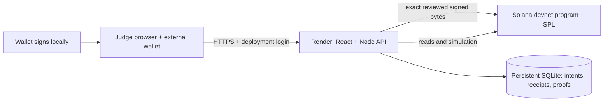

# Hosting preparation / Подготовка хостинга

[English README](../README.md) · [Русский README](../README.ru.md)

## Current deployment decision

Use **one Render Docker web service with a dedicated persistent disk**, the existing Node API and its built React UI on the same HTTPS origin, and Solana **devnet** for chain execution. The localnet validator remains a local verification tool. The hosted service holds public recovery metadata in SQLite; it does not hold investor, issuer or deployment private keys.



The checked-in [Dockerfile](../Dockerfile), [Render Blueprint](../render.yaml) and [hosted entrypoint](../scripts/start-hosted.ts) are **preparation artifacts**. No Render resource, public URL or paid subscription has been created. Repository visibility remains private.

Render's [persistent disks](https://render.com/docs/disks) require a paid service; [free web services](https://render.com/docs/free) lose local SQLite files on restart/redeploy. A zero-cost Render service cannot meet this implementation's durable-journal contract. Do not remove the mount check or relabel an ephemeral demo as durable. If a strict zero-hosting budget remains mandatory, a separately implemented and verified durable external datastore is needed. No paid provisioning is authorized by this preparation.

Vercel can host the UI, but the current API is a long-running Node process with transactional local SQLite. It is not packaged as a [Vercel Function](https://vercel.com/docs/functions/runtimes/node-js). A split Vercel/Render deployment would add authentication/origin/proxy work without removing the API's storage requirement. The prepared path uses Render for both UI and API.

Official platform references inspected9October2026: [Render Docker](https://render.com/docs/docker), [web services](https://render.com/docs/web-services), [Blueprint fields](https://render.com/docs/blueprint-spec). Platform terms, account consent and costs remain owner decisions.

## Deployment contract

| Setting | Required behavior |
|---|---|
| `BONDTRACE_DEPLOYMENT=hosted` | Explicit opt-in; local default remains loopback |
| `BONDTRACE_NETWORK=devnet` | Official devnet RPC; genesis is checked, mainnet excluded |
| `BONDTRACE_ENABLE_DEMO=false` | No generated signer/bootstrap; keys are neither read nor created |
| `BONDTRACE_PUBLIC_ORIGIN` | Exact application HTTPS origin, no credentials/path/query; never infer it from an incoming Host header |
| `BONDTRACE_HTTP_USER` | Deployment access username,3–64 ASCII letters/digits/underscore/hyphen |
| `BONDTRACE_HTTP_PASSWORD` | Unique random24–256 printable ASCII characters; supply as a Render secret, never a wallet password or committed file |
| `BONDTRACE_PERSISTENT_ROOT` | `/app/.local/hosted`, a real dedicated Linux mount; overlay/tmpfs startup is rejected |
| `BONDTRACE_DATA_DIR` | `/app/.local/hosted/devnet`; namespace below that volume |
| `PORT` | Platform-assigned valid integer; hosted listener binds0.0.0.0 |
| `BONDTRACE_RUNTIME_MIN_FREE_MB=64` | Signing/first relay stop below the configured metadata disk budget |

The entrypoint verifies the mount and changes only its dedicated volume root's ownership, then drops to UID/GID1000 before importing the API. All app/API paths require deployment HTTP Basic authentication; `/healthz` alone returns only `{status:"alive"}` without auth or RPC/database detail. HTTPS terminates at Render. This access password protects the private test deployment; **Solana signatures and on-chain roles still authorize financial instructions**.

The origin allowlist contains only the configured hosted origin. No redirect is followed by the core RPC transport. Normal external-wallet relay retains exact-message verification, commit-before-send, release/genesis binding and explicit uncertain-status recovery. Test execution stays available in explicitly enabled local development; hosted startup refuses it.

## Build, provision and verify

1. Review the current source and owner-approved hosting budget. `render.yaml` selects a paid `starter` service plus1GB disk and disables automatic deploys; **do not provision it before approval**.
2. Deploy the frozen program to devnet with isolated project deployment tooling and free test SOL. Verify its ID, loader, bytecode hash and genesis through `/api/program`; keep the deployment authority key outside Git and the hosting image. The program ID and expected hash are in `programs/bondtrace/release.json`.
3. Connect the private GitHub repository to Render as the owner, select the reviewed Blueprint, and supply the exact allocated HTTPS origin and unique deployment login through Render secrets. Mount `/app/.local/hosted`. Run **one instance**; this SQLite adapter is not a distributed database.
4. Confirm `/healthz` responds and an unauthenticated `/` returns401. Sign in through the browser's normal deployment login, then inspect `/api/health` and `/api/program`. Liveness alone does not establish financial readiness.
5. Run the HTTP verifier using operator credentials in the local environment, not a URL or shell-history literal:

```powershell
# BONDTRACE_PUBLIC_ORIGIN / BONDTRACE_HTTP_USER / BONDTRACE_HTTP_PASSWORD
# must already be supplied securely for this specific deployment.
npm run verify:hosted
```

6. Connect an external devnet-compatible wallet, fund it with **test SOL**, create a fresh draft, register/distribute before sealing, fund a test SPL reserve, capture the record, settle coupons, vote and redeem. Verify actual signatures and SPL burn/account effects. Never reuse localnet receipts as devnet proof.
7. Restart/redeploy the hosted service and recover the **same** saved IDs/signatures. Compare reconciliation and retained proof; do not rerun a new financial driver to conceal lost metadata.

Local image build command: `docker build -t bondtrace-hosting .`. Supply an owned named volume at `/app/.local/hosted` and secret environment values when testing the image; no `target/`, `.local/`, keys, auth files or `.env` enter its build context. The image uses the version-pinned official Node22.14.0 tag; an image digest/build result has not yet been verified here. Browser financial interaction must be checked through the final HTTPS origin, in addition to the loopback HTTP protocol smoke.

## Persistence and recovery

The volume contains only public metadata. Preserve `metadata.sqlite` and its namespace across releases. Existing schema/chain identity guards reject unrelated data or a changed ledger. Before a planned redeploy, use `npm run metadata:check` and `npm run metadata:backup` **inside the running service with its existing environment**. Backups use a consistent SQLite snapshot, integrity validation and a unique destination; they do not export wallet keys. Copy backups to an independently retained destination under owner control. A backup on the same disk is not protection against losing the disk; no off-host backup is claimed.

Do not copy an open SQLite file as a backup or automatically restore an older image of the journal: on-chain actions after that backup may already have executed. Keep every unresolved signature, compare chain/account effects and reconcile before any replacement signature. Render disk redeploys can interrupt availability; the deployment is not claimed to be zero downtime. Public RPC429/history gaps remain explicit service limitations.

## What was actually verified

| Evidence | Scope |
|---|---|
| Current Windows Node suite241/241 and app build | Source/backend regressions including3asset-repair cases; mock transports remain mocks |
|11initial targeted tests on isolated Linux Node22.14.0;14after the supported asset repair | Hosted policy, RPC redirect rejection, disabled signer boundary, entry JS/CSS verification and actual HTTP static routes |
| Actual Linux hosted process | Correct/incorrect Basic auth, built HTML, foreign-origin403, disabled bootstrap403, devnet genesis/readiness |
| Actual dedicated ext4 bind mount | Ephemeral startup refused; API UID1000; SQLite marker survived graceful stop/start; consistent backup integrity passed; no generated key directory |
| Preserved source provenance | Published44ed2fc plus14explicitly hashed hosting overlays; separate from concurrent frontend work |

Public summaries: [initial Linux check](evidence/hosted-linux-20261009.json), [supported asset repair](evidence/hosted-linux-h1-20261009.json). The verifier now checks actual entry JS/CSS responses, MIME, non-HTML content and SHA-256; absent assets return404 rather than an HTML fallback. Its default requires the exact deployed program. An explicit program-gate diagnostic override is accepted only on loopback and is recorded with `financialReady:false`; it cannot certify a public deployment.

These are real Linux process/mount tests, **not Docker-image, Render-public-URL, devnet-financial or human-wallet certification**. Docker Desktop processes were available but its engine API did not become available during the check. Source/logs/test volume were retained; only the owned test API stopped and its test mount was detached.

On9October the official devnet read showed the program absent. One bounded faucet request to a newly generated isolated test signer returned no signature; its observed balance remained0. The request record was retained without automatic repeat. Devnet deployment, full hosted wallet/lifecycle execution and final public URL therefore remain open gates. No funds, account login or paid plan are assumed.

## Русский

Подготовлен один Render Docker-сервис: интерфейс и API на одном HTTPS-origin, Solana devnet и постоянный SQLite-диск. Localnet остаётся способом локальной проверки. Пользовательские/деплой-ключи на хостинг не передаются. Dockerfile, render.yaml и hosted-entrypoint — готовые исходники для следующего этапа; платных ресурсов и публичного URL пока нет.

Hosted-режим требует devnet, `BONDTRACE_ENABLE_DEMO=false`, точный HTTPS-origin, отдельные учётные данные доступа для жюри и настоящий Linux mount `/app/.local/hosted`. Он отвергает временную файловую систему, запрещает генерацию/чтение demo-ключей и запускает API от UID1000. Вход в deployment не заменяет подпись кошелька и роли Solana. Только `/healthz` открыт без входа и показывает исключительно liveness.

Постоянные диски Render требуют платного сервиса; бесплатный Render теряет SQLite при перезапуске. Подготовленный Blueprint использует `starter` +1GB, поэтому его создание требует отдельного одобрения бюджета. Обходить проверку диска ради бесплатного запуска нельзя. Для строго нулевого бюджета понадобится отдельно реализовать и проверить внешнее постоянное хранилище. Vercel сам по себе не заменяет работающий Node API и SQLite.

Порядок запуска: одобрить инфраструктуру → развернуть и проверить frozen-программу на devnet за тестовые SOL → подключить приватный GitHub к Render → задать выделенный HTTPS-origin и уникальный пароль deployment в secrets → смонтировать диск → проверить вход/API/program → выполнить `verify-hosted.mjs` с обязательным совпадением программы → провести полный цикл своим devnet-кошельком → перезапустить сервис и восстановить те же IDs/signatures. Автодеплой отключён; используется одна инстанция.

Проверены241Node-тест, сборка и отдельный Linux-процесс с настоящим ext4 mount: авторизация, origin, запрет demo, UID1000, сохранение SQLite-маркера после перезапуска, integrity backup и отсутствие ключей. Linux-копия имеет собственный manifest; это не proof текущего Render/Docker-image или исполнения финансовых операций на devnet. У devnet-программы пока нет deployment, faucet не вернул подпись и баланс остался0; повторный запрос не отправлялся. Полный hosted/Phantom-сценарий остаётся открытым.

Backups выполнять штатным SQLite snapshot внутри сервиса, отдельно сохранять вне диска, не восстанавливать старый журнал поверх новых ончейн-выплат. Неизвестные статусы восстанавливаются по прежним подписям; новая подпись не является способом восстановления. Видео, доступ жюри, account consent, бюджет, публичная публикация и финальная заявка остаются действиями владельца.
