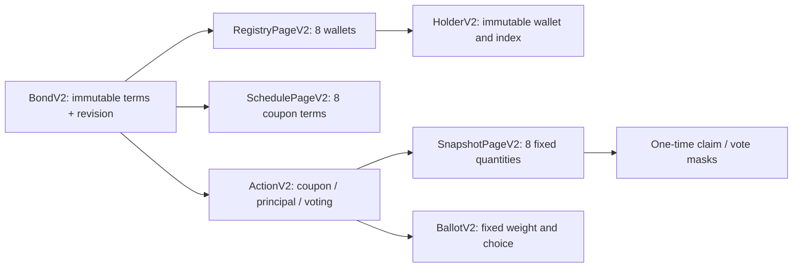

# Paged corporate actions (v4) / Постраничные корпоративные действия

This is the engineering contract for the additive v4 implementation. The older public devnet cohort in [deployment evidence](33-HOSTED-DEPLOYMENT.md) uses the v3 image. A localnet v4 result must not be presented as a public v4 deployment. Current validation and deployment status belong in the release evidence linked from the README.

Это технический контракт новой версии v4. Старый публичный devnet-прогон относится к v3. Localnet-доказательство v4 не подтверждает обновление публичной программы; актуальный статус проверок и развёртывания указан отдельно в README.

## Account architecture / Архитектура аккаунтов

The existing instructions, discriminators and account layouts remain available. New issues use separate v2 account discriminators and PDA seeds; no old holder registry or snapshot is rewritten in place.



`BondV2` stores nominal, annual basis-point rate, coupon frequency, maturity, supply, phase and revision. Registry indices are append-only. Each action fixes its holder-count prefix before capture. Each captured page fixes its quantities once; only settlement/voting masks and totals subsequently change under program checks.

В `BondV2` сохраняются номинал, ставка в basis points, частота купонов, погашение, supply, стадия и revision. Индексы держателей только добавляются. Событие заранее фиксирует длину реестра; количества в созданных страницах снимка изменить нельзя. Маски выплат/голосов меняются только однократно по правилам программы.

## Authority and liveness / Полномочия и доступность

| Operation / Операция | Required signer / Подписант |
|---|---|
| Create issue, append terms, register receivers, issue, activate / Создание, условия, реестр, размещение, активация | Issuer / Эмитент |
| Transfer bonds / Перевод облигаций | Current holder / Текущий держатель |
| Open due coupon or maturity capture / Открытие наступившей фиксации | Any fee payer / Любой плательщик комиссии |
| Capture the next page, finalize all pages / Следующая страница, завершение снимка | Any fee payer / Любой плательщик комиссии |
| Claim a coupon / Получение купона | Recorded holder / Зафиксированный держатель |
| Settle a coupon to its canonical beneficiary / Выплата купона фиксированному получателю | Any executor / Любой исполнитель |
| Burn bonds and receive principal / Сжигание и номинал | Corresponding holder / Соответствующий держатель |
| Open a voting proposal / Создание голосования | Issuer / Эмитент |
| Submit the fixed-weight ballot / Голос с фиксированным весом | Eligible holder / Держатель с правом голоса |

An absent issuer cannot veto maturity opening. All due coupon records still have to be completed first. Any fee payer can finish capture, including an already-open voting capture whose ballot deadline has expired. Principal recipients and amounts cannot be chosen by that executor. Each holder signs their own principal burn/payment transaction.

Отсутствующий эмитент не блокирует открытие погашения. Предшествующие купонные фиксации должны быть завершены; это может сделать любой плательщик комиссии. Уже открытый снимок голосования можно завершить и после его дедлайна. Исполнитель не выбирает получателей или суммы номинала: держатель сам подписывает своё погашение.

The upgrade authority is still a test deployment authority. Permissionless servicing does not remove the separately disclosed program-upgrade or settlement-mint trust assumptions.

## Record date / Дата фиксации

1. A due uncaptured record prevents transfers. Opening an action also locks transfers and registry appends until capture is finalized.
2. Pages must be captured in order. Duplicate/skipped pages and incomplete finalization are rejected.
3. Finalization reconciles captured units with issued supply. Claims are unavailable before finalization.
4. Zero-balance receivers can be registered after activation between record locks. Their new indices lie outside older action prefixes and grant no historical rights.
5. Later transfers or principal burns do not rewrite prior coupon/voting quantities.

Наступившая незафиксированная дата останавливает переводы. Во время фиксации также нельзя добавлять держателей. Страницы фиксируются последовательно; права доступны после проверки полного снимка. Нового получателя можно добавить после активации между блокировками, но старые купоны ему не принадлежат. Перевод и burn не изменяют прошлые снимки.

Classic SPL holding accounts remain frozen outside controlled program transfers. This deliberately enforces the servicing/record-date policy. Ordinary SPL transfers and DEX compatibility are not implemented. Replacing this policy would require a separately verified transfer-control design rather than simply unfreezing accounts.

Счета classic SPL заморожены вне контролируемых переводов программы. Это часть политики обслуживания и record date. Обычные SPL-переводы и совместимость с DEX не заявляются; простое снятие заморозки нарушило бы гарантии фиксации.

## Arithmetic and retirement / Расчёты и погашение

```text
perBondCouponMinor = faceValueMinor × rateBps / (10,000 × frequency)
holderCouponMinor  = fixedUnits × perBondCouponMinor
principalMinor     = maturityUnits × faceValueMinor

1,000 × 10% ÷ 2 = 50 per bond
10 × 50 = 500 coupon; 10 × 1,000 = 10,000 principal
```

All financial quantities use checked integers: bond decimals 0, settlement decimals 6, BigInt in TypeScript and decimal strings in JSON. Annual terms are immutable on-chain. Nonzero remainders at the settlement base-unit boundary are rejected; no silent floor/float rounding occurs. Coupon dates are explicit and accelerated only for the test demonstration; frequency is the annual divisor, not an inferred day-count convention.

Деньги считаются целочисленно с проверкой переполнения. Нельзя объявить ставку, противоречащую купонным суммам. Дробный остаток меньше минимальной единицы расчётного токена отклоняется. Тестовый сценарий ускоряет даты; для реального выпуска календарь задаётся явно.

Holder claims and executor settlements share the same per-event paid bit. Principal settlement atomically transfers the nominal and burns the corresponding quantity. Failure of the payment CPI rolls back the burn and masks. Historic unpaid coupons remain claimable after principal retirement. `principal redeemed` and `all obligations settled` are separate states.

Claim и settlement используют одну маску выплаты. Перевод номинала и burn атомарны: ошибка платежа откатывает сжигание и маски. Старые неоплаченные купоны сохраняются после погашения; погашенный номинал ещё не означает оплату всех обязательств.

## Explicit limits / Явные границы

| Layer / Уровень | Contract / Контракт |
|---|---|
| Protocol pages | 8 holders or terms per page; u32 counts replace the whole-issue 16/8 limits |
| Browser creation | Up to 16 coupons per browser-created issue; larger declared schedules require explicit API/CLI initialization and page appends (no browser append control) |
| Complete API graph | Budget of 4,096 account observations; oversized graphs fail closed |
| Scoped inspection | `/api/v2/instruments/:bond/pages/{registry|schedule|snapshot}/:page`; a page is not a full financial reconciliation |
| Proposal reads | Up to 64 history IDs plus required/active actions within the account budget; incomplete discovery is disclosed |
| Local discovery metadata | 512 proposal IDs and 128 optional holder labels; sticky truncation flags, on-chain records and journal retained |
| Local instrument catalog | 250 issues per deployment namespace |
| CLI batches | Up to 3 initial holders within one registry page; up to 4 coupon beneficiaries; fixed groups retained across resume |
| Principal | One holder-signed redemption transaction per holder |
| Solana wire | 1,232-byte maximum; measured offline scale groups 884/1,004 bytes including compute-budget instruction |

The larger counters are not a claim that billions of holders were load-tested. The recorded program-scale cohort is 33 initial holders, one later receiver and 9 coupons. Source evidence must identify whether it used LiteSVM, an actual RPC validator, or public devnet.

Увеличенные счётчики не означают нагрузочный тест на миллиардах держателей. Проверяемый масштабный сценарий — 33 исходных держателя, один новый получатель и 9 купонов. Для каждого результата отдельно указывается LiteSVM, настоящий RPC/localnet или публичный devnet.

V2 reads batch account requests and recheck the Bond revision before/after the graph. Every program mutation increments that revision. The response exposes its slot interval and `sameBank:false`; external SPL observations are disclosed separately. The final transaction revalidates accounts and runs fresh simulation; an API read is not a reservation of funds.

API читает граф пакетами и повторно проверяет revision. Ответ честно показывает диапазон слотов и `sameBank:false`; он не объявляется единым атомарным bank snapshot. Финальная транзакция заново проверяет аккаунты и проходит симуляцию. Чтение API не резервирует деньги.

## Durable recovery and integrations / Восстановление и интеграции

The exact signed wire, signature, lifetime and operation identifier are committed before relay. Unknown outcomes stop the driver. Explicit same-ID recovery reads the original receipt; it never signs a replacement. SQLite uses DELETE/EXTRA and verified rollback; an initialized cold reader does not reserve a writer lock. Native lock contention becomes `STORAGE_BUSY` only after transaction cleanup is known. A busy GET retains its operation identifier and does not invent confirmation. Hosted PostgreSQL still requires acknowledged COMMIT and writer fencing.

Wire, подпись, срок и ID сохраняются до отправки. Неизвестный результат останавливает сценарий. Повторный GET проверяет прежний ID и не создаёт другую подпись. SQLite сохраняет DELETE/EXTRA и проверенный rollback; занятость возвращается как восстановимое состояние без ложного подтверждения. PostgreSQL сохраняет строгий COMMIT и fencing.

The [integration contracts](integrations/PILOT-CONTRACT.md) support signed holder-registry attestations, exact immutable settlement instructions, durable per-holder outboxes, signed acknowledgements, replay/conflict handling and audit export. Default integration policy is disabled until trusted public keys are configured. External acknowledgements remain **shadow/sandbox evidence**, with dispatch disabled; they never mark an SPL claim paid or burn a bond.

Интеграционный слой сверяет подписанный реестр с Solana, формирует точные инструкции и сохраняет ACK с защитой от повторов и конфликтов. По умолчанию доверенные ключи не настроены. Внешние подтверждения работают в shadow/sandbox, не отправляют банковские платежи и не помечают ончейн-обязательство оплаченным. Подключение KASE, депозитария или банка и реальный пилот остаются неподтверждёнными.

## Run / Запуск

After the documented Windows/WSL toolchain setup, the additive lifecycle launcher is:

```powershell
npm run demo:paged:lifecycle
# Larger cohort, explicit ports and the same immutable recovery ID on rerun:
pwsh -NoProfile -File scripts/lifecycle-demo.ps1 -Paged -Scale33 -LateCoupon -RpcPort 8999 -ApiPort 3200
```

It reuses the protected runtime launcher, skips legacy bootstrap, retains a public immutable launch plan and runs the real localnet paged driver. Existing occupied unrelated ports or a mismatched program release are rejected. Actual one-command verification must be recorded separately from parser/helper tests.

После подготовки окружения команда собирает программу/приложение и запускает изолированный localnet-сценарий с сохранённым планом. Занятые чужие порты, другая версия программы и изменённые параметры повторного запуска отклоняются. Проверка parser/helper отдельно не подтверждает реальный сквозной запуск.

For a prepared native localnet workspace, the raw CLI is also available. It requires an explicit ignored paged-demo data namespace and loopback RPC:

```bash
BONDTRACE_NETWORK=localnet BONDTRACE_ENABLE_DEMO=true \
BONDTRACE_DATA_DIR=.local/paged-demo/judge/data SOLANA_RPC_URL=http://127.0.0.1:8999 \
npm run demo:paged -- --scale33 --late-coupon --operation-id judge_paged_v4_01
```

`npm run demo:integration` demonstrates actual loopback HTTP counterparties with a **synthetic chain fixture**. `npm run verify:integration -- --help` describes the separate verifier for an actual built product origin and direct localnet RPC. Its authority descriptor stays ignored and is never a submitted artifact. Neither command proves a bank/KASE partnership or ordinary Phantom signing.
